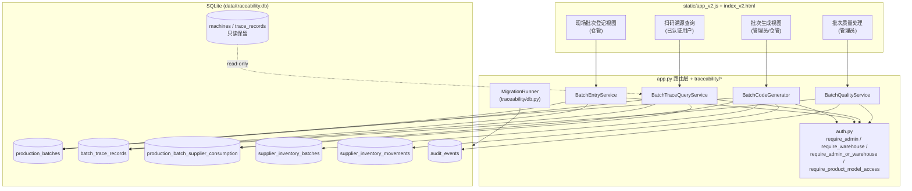
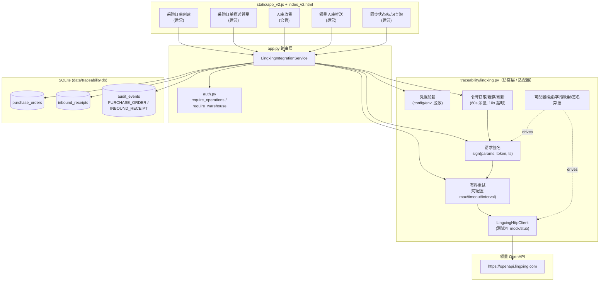

# 设计文档：按批次溯源（batch-traceability）

## Overview

本特性将走步机成品的溯源粒度从「单台 / 单部件」调整为「按生产批次」。核心是在既有 **Flask + SQLite** 单体架构（`app.py` 路由层、`traceability/` 领域模块、`static/app_v2.js` 前端、`templates/index_v2.html` 页面）之上，**新增一条批次溯源链路**，同时**只读保留**历史逐台数据，并**停用**走步机产品的逐台 / 逐部件现场录入入口。

关键设计取向（对齐已确认决策 A–G）：

- **A 登记形态**：一次扫码形成**单条携带数量**（如 1000）的批次登记记录，而非 1000 条单台记录。
- **B 旧流程处置**：走步机的逐部件扫码与逐台族谱停用，历史记录只读保留。
- **C 历史数据**：沿用现有 `traceability/db.py` 的**增量非破坏性迁移**风格（只新增列 / 表 / 索引），`user_version` 从 `11` 升级到本特性目标版本 **`12`**。
- **D 供应批次关联**：在**批次粒度**保留「生产批次 ↔ 供应批次」关联以支撑正向 / 反向追溯。
- **E 库存扣减**：生成批次仍按 `N × 每套用量` 扣减供应库存，复用既有 `supplier_inventory_batches` / `supplier_inventory_movements`。
- **F 二维码 / 记录信息**：批次二维码 / 记录携带批次码值、产品型号、登记台数、生成时间、前缀、操作人。
- **G 质量状态**：待检（ASSEMBLED）/ 合格（PASSED）/ 暂扣（HOLD）状态闭环在批次级沿用，复用 `audit_events` 记录审计。

**「每套用量（Per_Unit_Usage）」的落地口径**：现有系统中，一个产品的有效 `trace_plans` 的每个 `trace_plan_slots` 绑定一个 `supplier_inventory_batch_id`，生成时每个 slot 对该供应批次消耗 1 件 / 台（见 `create_product_code_sets`）。本特性沿用该口径：某供应批次的每套用量 = 有效追溯计划中绑定该供应批次的 slot 数量（通常为 1）。批次生成时对该供应批次的所需扣减 = `N × 每套用量`。此定义与既有单台生成的扣减行为在 `N=1` 时完全一致，保证行为可迁移、可回归。

### 领星（Lingxing）ERP 集成概述（Req 12–20）

在批次溯源之外，本特性追加**领星 ERP 单向推送集成**。核心取向（对齐已确认决策 H–L）：

- **H 数据流向**：**本系统为数据源头**，向领星 **PUSH-only（单向推送）**；不从领星拉取、不做双向同步。领星是下游接收方，本系统内的采购订单 / 入库收货记录为权威数据。
- **I 业务流程**：运营在本系统「下采购订单」→ 推送采购订单至领星；仓管针对采购订单「入库（收货）」→ 运营执行「领星入库」将入库收货推送至领星。
- **J 角色（已收敛为三角色模型，见 M）**：系统**恰好三个角色** `ADMIN`（管理员）/ `WAREHOUSE`（仓管）/ `OPERATIONS`（运营），单账号恰好持有其中一个。**原 `OPERATOR`（录入员）角色撤销**，其现场扫码登记 / 入库能力并入 `WAREHOUSE`。下采购订单 / 推送采购订单 / 领星入库 / 库存同步限运营；入库收货 / 生成生产订单 / 扫码枪入库 / 批次扫码登记限仓管；系统设置与用户管理仅限管理员。生成生产批次 / 生产订单的授权由「仅管理员」放宽为「管理员或仓管」。
- **K 凭据**：`appId` / `appSecret` / `id` 尚未下发，以**运行时配置 / 环境变量 / 系统设置页面录入**管理，**不硬编码**；缺失时清晰报错并**安全降级**（不影响批次溯源等无关功能）。
- **L OpenAPI 事实**：主机固定为 `https://openapi.lingxing.com`；OAuth 式以 `appId + appSecret` 换取 `access_token`、以 `refresh_token` 刷新、业务请求以 `sign`（由请求参数 + `access_token` + `timestamp` 计算）签名。**具体端点路径、字段映射与签名算法细节以领星官方文档 `https://apidoc.lingxing.com/` 为准，在凭据可用后确认**——因此均建模为**可配置的适配器 / 防腐层（anti-corruption layer）**，后续可在不改动核心逻辑的前提下填充。

新增领域服务 **LingxingIntegrationService**（承载于 `app.py` 路由处理函数 + 新增 `traceability/lingxing.py` 辅助模块），职责：凭据加载（配置 / 环境变量，非硬编码）、访问令牌获取 + 缓存 + 自动刷新（60 秒安全余量、10 秒令牌请求超时、有界重试）、请求签名（`sign` = f(params, access_token, timestamp)）、有界重试（可配置最大重试 0–10 次、默认 3；单次请求超时 1–120 秒、默认 30；重试间隔 1–60 秒、默认 2）、可重试 / 不可重试错误分类、日志与响应中的密钥脱敏、以及凭据缺失时的优雅降级。

## Architecture

### 分层与新增组件

新增四个领域服务（承载于 `app.py` 的路由处理函数 + 少量 `traceability/` 辅助函数中，保持既有单体风格，不引入新框架）：

- **BatchCodeGenerator**：生成生产批次 + 批次二维码 + 扣减库存 + 写批次级供应关联（管理员或仓管）。
- **BatchEntryService**：扫描批次二维码，一次性登记整批台数（仓管 / 管理员）。
- **BatchTraceQueryService**：扫描批次二维码执行**只读**溯源查询（已认证用户）。
- **BatchQualityService**：批次级质量状态闭环（合格 / 暂扣，管理员）。



### 事务与并发模型

- 复用既有连接配置（`connect_database`：`isolation_level=None` 自动提交、`PRAGMA foreign_keys=ON`、`busy_timeout=10000`、WAL）。
- 写路径（批次生成、批次登记、质量变更、迁移）统一使用 **`BEGIN IMMEDIATE` … `COMMIT` / 异常 `ROLLBACK`** 包裹，与 `create_product_code_sets`、`auth.create_user` 保持一致。
- `BEGIN IMMEDIATE` 立即取得写锁，使并发的批次生成对同一供应批次结存的扣减**串行化**（对应 Req 4.5）；SQLite 单写者语义配合 `busy_timeout` 保证累计扣减不超过可用结存。

### 二维码编码与解析

- 批次码值（`batch_code`）：全局唯一字符串，格式 `B-{prefix}-{date_code}-{token}`（`token` 为 `secrets.token_hex(3)` 大写），在 `production_batches.batch_code` 上以 `UNIQUE COLLATE NOCASE` 保证唯一。
- 二维码 payload：`PTS:B:{batch_code}`（沿用 `PTS:M:` / `PTS:P:` 前缀风格）。新增 `traceability/codes.py` 辅助函数：`new_batch_code(now_compact, prefix)`、`batch_identification_code(batch_code)`、`parse_batch_payload(payload)`。
- 扫码登记 / 查询接受完整 payload（`PTS:B:...`）或裸 `batch_code`，由 `parse_batch_payload` 归一化后按 `batch_code` 查库。

### 领星集成架构（Req 12–20）

新增 `traceability/lingxing.py` 作为**防腐层 / 适配器**，将「领星 OpenAPI 的具体形态」与「本系统核心业务逻辑」解耦。`app.py` 路由层只依赖该模块暴露的稳定接口（下采购订单、推送采购订单、入库、领星入库、查询同步状态），而端点路径、字段映射、签名算法等易变细节全部由**可配置项**驱动。



#### 凭据加载与安全降级（Req 13, 21）

- 凭据从**运行时配置 / 密钥来源**读取，读取优先级为「`app_settings` 设置存储（管理员在系统设置页面录入，见「系统设置」小节） → 环境变量 `PTS_LINGXING_APP_ID` / `PTS_LINGXING_APP_SECRET` / `PTS_LINGXING_ID`（沿用 `os.environ.get` 风格，见 `create_app`） → 可选配置文件」；**源码与版本库中不内置任何 appId / appSecret / id 明文**。凭据三元组为 `appId` / `appSecret` / `id`（Req 13.1）。
- **凭据缺失判定**：`appId`、`appSecret` 或 `id` 中任一为 `None`、空串或仅空白字符（`str.strip()` 为空）即视为「未配置」。
- **降级行为**：凭据缺失时，任何需要调用领星的操作（推送采购订单、领星入库、令牌获取）在**发起任何网络请求前**即被拒绝，返回「领星凭据未配置」描述性错误，且**不修改任何本地业务数据**；本系统其余功能（批次溯源、采购订单本地创建、入库收货本地创建、账号 / 产品 / 供应商管理）不受影响，服务启动与整体可用性不受影响。
- **脱敏**：`appSecret`、`id`、`access_token`、`refresh_token` 在日志与接口响应中一律脱敏——至多保留末尾 4 位，其余以掩码字符（`*`）替换；提供 `mask_secret(value)` 辅助函数统一处理（Req 13.4, 21.3）。

#### 访问令牌生命周期（Req 14）

`LingxingTokenCache`（进程内、线程安全，`threading.Lock` 保护，沿用既有 `BLUETOOTH_OPERATION_LOCK` 风格）缓存 `access_token`、`refresh_token` 与 `access_token` 到期时间：

- **有效性判定**：仅当「当前时间 < 到期时间 − 60 秒安全余量」时缓存视为有效并复用。
- **获取**：缓存为空或已过期且无有效刷新令牌时，用 `appId + appSecret` 换取新令牌；单次令牌请求超时 **10 秒**。
- **刷新**：缓存过期但 `refresh_token` 仍有效时，用 `refresh_token` 换新 `access_token` 并更新缓存与到期时间。
- **回退**：刷新令牌无效或刷新失败时，回退为用 `appId + appSecret` 重新获取。
- **令牌请求重试**：单次令牌获取 / 刷新因网络错误或超时失败时，最多重试 2 次（累计 ≤ 3 次），相邻请求间隔 ≥ 1 秒。
- **耗尽失败**：重试耗尽后仍失败，则中止本次领星调用、**不修改任何本地业务数据**，返回指明令牌获取失败原因的描述性错误。

#### 请求签名（Req 15）

- `sign = compute_sign(params, access_token, timestamp)`：依据请求参数、当前有效 `access_token` 与请求发起时刻 `timestamp`（单位 / 格式以领星官方文档为准，作为可配置项）计算。
- `sign` 与用于计算它的**同一** `timestamp` 一并随请求发送；不修改参与签名的任何参数值（签名对给定输入是**确定性**的）。
- 若缺少有效 `access_token` 或任一必要参数，中止请求、不发起外部调用、不修改本地数据，返回「无法生成请求签名」错误。
- 具体签名算法（拼接顺序、摘要算法等）建模为**可配置 `SignStrategy`**，默认实现给出占位算法，凭据 + 官方文档确认后替换而无需改动调用方。

#### 有界重试与错误分类（Req 19）

- 可配置项（带边界校验与默认值）：`max_retries`（0–10，默认 3）、`request_timeout`（1–120 秒，默认 30）、`retry_interval`（1–60 秒，默认 2）。
- **可重试错误**：网络超时、连接失败、领星限流（如 429）、临时性服务端错误（如 5xx）——在不超过 `max_retries` 的前提下按 `retry_interval` 间隔重试，每次请求以 `request_timeout` 为上限。
- **不可重试错误**：鉴权失败、凭据无效、参数校验失败——**不重试**，直接标记对应记录同步状态为 `FAILED` 并返回含领星错误信息的描述性错误。
- **幂等**：所有推送以本地已记录的领星标识为准做幂等保护，无论重试多少次都不在领星侧产生重复的采购订单 / 入库单（见「事务与幂等模型」）。

#### 事务、幂等与并发模型（Req 16, 18, 19, 20）

- 复用既有连接配置与 `BEGIN IMMEDIATE … COMMIT / 异常 ROLLBACK` 事务风格。
- **本地写**（创建采购订单、创建入库收货、推送成功后回写领星标识 + 同步状态、失败后置 `FAILED`）均在事务内完成，失败回滚、无部分写入。
- **幂等保护**：对已 `PUSHED` 的采购订单 / 入库收货再次推送时，**不发起领星调用**，直接返回本地已记录的领星标识（`lingxing_po_id` / `lingxing_inbound_id`）与「已推送」提示。
- **进行中守卫（in-progress guard）**：`inbound_receipts.push_in_progress`（0/1）在推送开始前于 `BEGIN IMMEDIATE` 事务内置 1、结束（成功 / 失败）后复位；并发的重复领星入库请求命中守卫时被拒绝，返回「推送正在进行中」错误，不发起新的领星调用（Req 18.6）。采购订单推送同样以该守卫防止并发重复推送。
- **前置条件**：领星入库要求其所属采购订单同步状态为 `PUSHED`，否则拒绝且不改状态（Req 18.3）。

### 角色与鉴权（Req 9, 12, 22）

**三角色模型（已确认决策 M）**：系统**恰好三个角色**，`traceability/auth.py` 的角色常量与集合改为：

```python
ROLE_ADMIN = "ADMIN"
ROLE_WAREHOUSE = "WAREHOUSE"     # 兼并原 OPERATOR（录入员）能力
ROLE_OPERATIONS = "OPERATIONS"
VALID_ROLES = {ROLE_ADMIN, ROLE_WAREHOUSE, ROLE_OPERATIONS}
```

- **撤销 `ROLE_OPERATOR`**：原「录入员（`OPERATOR`）」角色不再作为合法角色；其现场扫码登记 / 入库能力**并入 `WAREHOUSE`（仓管）**。产品型号授权（`user_product_model_permissions`）的范围检查从原「仅 `OPERATOR` 生效」调整为「仅 `WAREHOUSE` 生效」——即 `current_operator_id()` 语义保持「对非管理员按授权过滤」，`_replace_user_scope` 中的 `role != ROLE_OPERATOR` 判定改为 `role not in {ROLE_WAREHOUSE}`（仅仓管持有产品 / 供应商授权范围，运营与管理员无按产品的范围限制）。
- 因 `users.role` 为**单值列**，一个账号恰好持有一个角色，天然满足「三角色互斥、不可同时持有运营与仓管」（Req 12.1, 9.6）；`db.py` 中 `users.role` 的 `CHECK` 约束改为 `IN ('ADMIN','WAREHOUSE','OPERATIONS')`（历史遗留 `OPERATOR` 行的迁移处理见「迁移到 user_version 14」）。

新增 / 调整守卫函数（与既有 `require_admin()` / `require_product_model_access()` 风格一致，未认证由 `before_request` 抛 401、角色不符抛 403）：

- `require_operations()`：仅 `OPERATIONS`（`ADMIN` 视为放行以便管理与排障）可执行创建 / 推送采购订单、领星入库、库存同步、采购单导出、工厂进度查询；否则 `AuthError("仅运营可以执行此操作", 403)`。
- `require_warehouse()`：仅 `WAREHOUSE`（`ADMIN` 视为放行）可执行入库收货、批次扫码登记、由采购订单生成生产订单、扫码枪入库；否则 `AuthError("仅仓管可以执行此操作", 403)`。此守卫**覆盖原录入员的现场录入 / 入库能力**。
- `require_admin_or_warehouse()`：`ADMIN` 或 `WAREHOUSE` 均可执行生成生产批次 / 生产订单与批次二维码（Req 9.1、12.4、23）；否则 `AuthError("仅管理员或仓管可以执行此操作", 403)`。生成生产批次的授权由原「仅管理员」放宽为此守卫。
- 系统设置与用户管理沿用 `require_admin()`（Req 12.2, 21.2, 22.1）。
- 未认证请求由既有 `before_request` 统一拦截（`/api/*` 需登录，写操作校验 `X-CSRF-Token`）。

> **对既有设计引用的收敛**：本文档早前在领星集成部分出现的 `require_operations` / `require_warehouse` 引用，均以此三角色模型为最终口径；不再存在 `OPERATOR` 相关授权路径。

## Components and Interfaces

所有接口沿用既有 `{"ok": true, "data": ...}` / `{"ok": false, "message": ...}` 响应约定与 `ApiError(message, status)` 错误模型；写操作要求登录会话 + `X-CSRF-Token`（`auth.py` 的 `before_request` 已统一拦截）。

### BatchCodeGenerator（Req 1, 3, 4, 5, 9, 11）

- `POST /api/production-batches` — 管理员或仓管生成批次。
  - 入参：`{ productModelId, quantity, prefix }`。
  - 校验：`require_admin_or_warehouse()`（Req 9.1）；仓管须对该产品型号有授权（`require_product_model_access`）；`prefix` 经 `normalize_entity_code`；`quantity` 为 `1..999999` 整数；产品存在且有 ACTIVE 追溯计划。
  - 事务内：库存充足性检查 → 扣减 `supplier_inventory_batches` → 写 `ISSUE` 到 `supplier_inventory_movements` → 插入 `production_batches` → 插入 `production_batch_supplier_consumption` → 写审计。
  - 出参：批次详情（含 `batchCode`、`downloadUrl` 等）。
- `GET /api/production-batches` — 列表（管理员全量；仓管按授权产品过滤）。
- `GET /api/production-batches/<id>` — 批次详情，含反向追溯清单与登记状态。
- `GET /api/production-batches/<id>/qr` — 返回 `image/svg+xml`（复用 `make_qr_svg`），批次不存在返回 404。

### BatchEntryService（Req 2, 6.1, 9）

- `POST /api/batch-entry/scan` — 仓管扫码一次性登记整批。
  - 入参：`{ code, stationId?, stationName?, operatorName?, quantity? }`（`quantity` 为可选的登记台数修正）。
  - 校验：`require_warehouse()`；解析 `code` → 批次存在；`require_product_model_access(batch.product_model_id)`；该批次**尚无**登记记录；`quantity`（若提供）为 `1..planned_quantity` 整数，缺省等于 `planned_quantity`。
  - 结果：事务内插入**单条** `batch_trace_records`（`registered_quantity`、`operator_name`、`completed_by_user_id`、`registered_at`、`quality_status='ASSEMBLED'`），不创建任何逐台记录。

### BatchTraceQueryService（Req 10）

- `POST /api/batch-trace/query` — 已认证用户扫码只读查询。
  - 入参：`{ code }`。
  - 校验：解析 `code` → 批次存在；管理员可查任意批次，仓管仅可查授权产品的批次。
  - 出参：只读溯源信息（`batchCode`、产品型号、`plannedQuantity`、`registeredQuantity`、生成时间、前缀、`qualityStatus`）+ 批次级反向追溯清单（供应批次标识、供应部件、消耗数量）。
  - **不产生任何数据变更**（纯 `SELECT`）。

### BatchQualityService（Req 6）

- `POST /api/batch-trace-records/<id>/pass` — 管理员将 ASSEMBLED → PASSED。
- `POST /api/batch-trace-records/<id>/hold` — 管理员将 ASSEMBLED → HOLD，入参 `{ reason }`（1..500 字符）。
- 二者：`require_admin()`；仅当当前状态为 `ASSEMBLED` 才允许转换，否则拒绝；成功后在同一事务写 `audit_events`（操作人、变更前后状态、时间，HOLD 时含原因）。

### 批次登记记录查询（Req 3.2, 3.4, 3.5, 3.6）

- `GET /api/batch-trace-records` — 入参 `{ batchCode?, from?, to?, search? }`。
  - 按生成批次或时间范围（含起止边界）匹配，结果按生成时间由近及远排序；无匹配返回空列表（非错误）；`from > to` 返回描述性错误。

### 正向追溯（Req 5.5, 5.6）

- `GET /api/supplier-inventory-batches/<id>/forward-trace` — 管理员查看消耗该供应批次的每个生产批次（批次码值、产品型号、生成时间、消耗数量）；无消耗返回空清单。

### 旧流程停用（Req 7）

- 前端 `static/app_v2.js`：走步机产品的现场录入视图（仓管）**仅呈现批次扫码登记**，移除每台主码 / 逐部件扫码装配入口。
- 后端 `app.py`：`/api/scan`、`/api/scan/*`、`/api/products/<id>/code-sets`（逐台生成）等**针对走步机产品型号**的调用被守卫拒绝：命中走步机产品时抛出 `ApiError("走步机产品已改为按批次溯源，逐台/逐部件录入入口已停用", 409)`，不创建任何逐台记录。非走步机产品行为不变。
- `machines` / `trace_records` / `product_code_sets` 等历史数据保持只读可查。

### LingxingIntegrationService（Req 12–20）

所有接口沿用 `{"ok": true, "data": ...}` / `{"ok": false, "message": ...}` 响应约定与 `ApiError` 模型；写操作要求登录会话 + `X-CSRF-Token`。响应中涉及令牌 / 密钥的字段一律脱敏。

#### 采购订单（Req 16, 20）

- `POST /api/purchase-orders` — 运营创建采购订单。
  - 守卫：`require_operations()`。
  - 入参：`{ supplierId, partTypeId, quantity }`（供应商、商品、采购数量）。
  - 校验：三者非空（缺失返回缺失字段名）；`supplierId` / `partTypeId` 存在；`quantity` 为 `1..999999` 整数。
  - 事务内：插入 `purchase_orders`（`sync_status='PENDING'`、记录创建人 / 创建时间）→ 写审计（`object_type='PURCHASE_ORDER'`, `event_type='PO_CREATED'`）。
  - 出参：采购订单详情（含 `id`、`poNo`、`syncStatus`）。
- `GET /api/purchase-orders` — 运营列表 / 查询采购订单及其同步状态，支持 `{ syncStatus?, supplierId?, from?, to? }` 过滤，按创建时间由近及远排序。
- `GET /api/purchase-orders/<id>` — 采购订单详情，含 `syncStatus`、`lingxingPoId`、`pushedAt`（未成功推送时后两者为空）。
- `POST /api/purchase-orders/<id>/push` — 运营推送采购订单至领星。
  - 守卫：`require_operations()`；凭据缺失即拒绝（Req 13.2）。
  - 前置：`sync_status ∈ {PENDING, FAILED}` 才推送；已 `PUSHED` 时**不发起领星调用**、返回既有 `lingxingPoId` 与「已推送」提示（Req 16.5）。
  - 成功（领星 30 秒内返回成功）：保存 `lingxing_po_id` + 原始响应、`sync_status='PUSHED'`、记录 `pushed_at`、写审计。
  - 失败 / 超时：保持记录存在、`sync_status='FAILED'`、写含领星错误的审计并返回描述性错误（Req 16.6）。

#### 入库收货（Req 17）

- `POST /api/inbound-receipts` — 仓管针对采购订单入库。
  - 守卫：`require_warehouse()`。
  - 入参：`{ purchaseOrderId, quantity }`。
  - 校验：`purchaseOrderId` 提供且对应采购订单存在（缺失 / 不存在返回描述性错误）；`quantity` 为 `1..999999` 整数。
  - 事务内：插入 `inbound_receipts`（关联采购订单、收货人 = 当前仓管用户、收货时间 = 系统当前时间、`sync_status='PENDING'`）→ 写审计。
  - 出参：新建入库收货记录标识作为成功确认。

#### 领星入库推送（Req 18）

- `POST /api/inbound-receipts/<id>/push` — 运营执行领星入库。
  - 守卫：`require_operations()`；凭据缺失即拒绝。
  - 前置：入库收货记录存在（否则拒绝，Req 18.2）；其所属采购订单 `sync_status='PUSHED'`（否则拒绝且不改状态，Req 18.3）；`push_in_progress=0`（否则「推送进行中」拒绝，Req 18.6）。
  - 幂等：已 `PUSHED` 时不发起领星调用、返回既有 `lingxingInboundId`（Req 18.4）。
  - 成功：保存 `lingxing_inbound_id` + 原始响应、`sync_status='PUSHED'`、`pushed_at`、写审计。
  - 失败 / 超时：保持记录与既有 `lingxing_inbound_id` 不变、`sync_status='FAILED'`、写含领星错误的审计并返回描述性错误（Req 18.5）。

#### 同步状态查询（Req 20.4, 20.5）

- `GET /api/purchase-orders/<id>/sync-status` 与 `GET /api/inbound-receipts/<id>/sync-status` — 运营查询某记录的当前同步状态、已记录领星标识与最近一次推送时间；从未成功推送时领星标识与推送时间返回为空（`null`）。记录不存在时返回描述性 404 错误。

### SystemSettingsService（Req 21）

系统设置页面为**仅管理员**可访问的通用设置页，承载通用系统设置项与领星凭据（`appId` / `appSecret` / `id`）录入。设置持久化于新增的 `app_settings`（键 / 值）表（见 Data Models），领星凭据以专用键（`lingxing.app_id` / `lingxing.app_secret` / `lingxing.id`）安全存储；`LingxingIntegrationService` 的凭据加载**优先读取该设置存储**（见「凭据加载与安全降级」）。

- `GET /api/settings` — 管理员读取通用设置与领星凭据（**脱敏回显**）。
  - 守卫：`require_admin()`（非管理员 403、未认证 401，Req 21.6）。
  - 出参：通用设置键值 + 领星凭据字段的**脱敏值**（`mask_secret`，至多末 4 位可见），绝不返回完整明文（Req 21.3）。
- `PUT /api/settings` — 管理员保存 / 修改通用设置与领星凭据。
  - 守卫：`require_admin()`。
  - 校验：领星凭据 `appId` / `appSecret` / `id` 各自长度为 `1..256` 字符且非纯空白（Req 21.3, 21.5）；任一字段缺失 / 空 / 纯空白 / 超 256 字符则拒绝、**保持既有已存储凭据不变**、返回长度要求错误（Req 21.5）。
  - 事务内：以 `BEGIN IMMEDIATE` upsert 到 `app_settings`，写审计（`object_type='APP_SETTINGS'`，`payload` 中凭据以脱敏形式记录）。
  - 出参：保存成功确认，凭据以**脱敏形式**呈现（Req 21.4）。
- **存储安全**：`app_settings` 中的敏感键（凭据）在读取 API、日志与审计中一律经 `mask_secret` 脱敏；写入前不做明文日志。凭据不写入源代码 / 版本库（Req 21.1 与 13.1 一致）。

### UserManagementService（Req 22）— 用户管理（原「录入员管理」更名）

复用 `traceability/auth.py` 既有账号管理基础设施（`create_user` / `update_user` / `_validate_username` / `_validate_password` / `_record_security_event`）。前端将原「录入员管理」入口更名为「用户管理」，功能仅限管理员（Req 22.1）。

- `POST /api/users` — 管理员新增用户（复用既有端点，调整角色校验）。
  - 守卫：`require_admin()`。
  - 入参：`{ username, password, role, displayName?, productModelIds? }`。
  - 校验：`username` 长度 `1..50`（沿用 `USERNAME_PATTERN` 字符集约束）；`password` 长度 `8..128`（`_validate_password`）；`role ∈ {WAREHOUSE, OPERATIONS, ADMIN}`（`VALID_ROLES`，非法角色拒绝，Req 22.4）；缺字段拒绝并指明缺失字段。
  - 重复用户名：命中 `users.username` 唯一约束时 `sqlite3.IntegrityError` → `AuthError("该账号已存在", 409)`（Req 22.5）。
  - 事务内：插入 `users` + 按角色写授权范围（仅 `WAREHOUSE` 持有产品 / 供应商授权）+ 写审计。
- `PUT /api/users/<id>` — 管理员编辑用户角色（复用既有端点）。
  - 守卫：`require_admin()`。
  - 入参：`{ role?, displayName?, active?, password?, productModelIds? }`。
  - 校验：`role ∈ {WAREHOUSE, OPERATIONS, ADMIN}`；单值列保证编辑后用户**恰好持有一个角色**（Req 22.3）；不允许停用 / 降级自身管理员（既有保护）。
  - 出参：更新成功确认。
- 非管理员 / 未认证访问用户管理端点被 `require_admin()` / `before_request` 拒绝（Req 22.6）。

### ProductionOrderService（Req 23）

仓管通过弹窗选择一条运营已提交、且**尚未被任何生产订单关联**的采购订单，生成生产订单；生成时**在同一事务内与生产批次机制同步**，自动绑定恰好一个全局唯一的**生产二维码**。生产二维码复用既有生产批次 / `batch_code` / `codes.py` 机制（新增 `new_production_qr_code` 或复用 `new_batch_code`，payload 前缀 `PTS:B:`），即一个生产订单对应一个 `production_batches` 行与其唯一 `batch_code`。

- `POST /api/production-orders` — 仓管选择采购订单生成生产订单。
  - 守卫：`require_admin_or_warehouse()`（Req 23.8；非仓管 / 非管理员 403、未认证 401）。
  - 入参：`{ purchaseOrderId }`。
  - 校验：`purchaseOrderId` 提供且对应采购订单存在（缺失 / 不存在 → 描述性错误，Req 23.7）；该采购订单**尚未**被任何生产订单关联（已关联 → 拒绝并提示「该采购订单已生成生产订单」，保持既有生产订单与其二维码不变，Req 23.6）。
  - 事务内（`BEGIN IMMEDIATE`，Req 23.1, 23.5）：同步生成一个 `production_batches`（含唯一 `batch_code`）→ 插入 `production_orders`（关联 `purchase_order_id` 与 `production_batch_id`）→ 写审计。任一步失败整体回滚，**不遗留无二维码的生产订单，也不遗留未关联生产订单的孤立二维码**（Req 23.5）。
  - 幂等 / 唯一：`production_orders.purchase_order_id` 上 `UNIQUE` 约束保证「一个采购订单至多一个生产订单」（Req 23.6 的并发保护）；`production_batch_id` 上 `UNIQUE` 保证一码对应一单（Req 23.2）。
  - 出参：生产订单详情（含 `id`、`productionQrCode`、来源 `purchaseOrderId`、`downloadUrl`）。
- `GET /api/production-orders` — 列表 / 查询（支持按来源采购订单过滤）。
- `GET /api/production-orders/<id>` — 生产订单详情。**支持「单产品单行」展示**：每个产品恰好占一行，至少含产品型号与数量（Req 23.4）。
- `GET /api/production-orders/<id>/qr` — 返回生产二维码 SVG（复用 `make_qr_svg`），不存在返回 404。

### ScanGunInboundService（Req 24）— 扫码枪入库

仓管用扫码枪扫描**生产二维码**检索对应生产订单，经弹窗（或单行入库按钮）填写入库数量，在单一事务内记录入库并将数量累加到对应**产品仓库库存**（新增 `product_stock` 与 `inbound_scan_records` 表）。

> **与供应入库（`inbound_receipts`）的区别**：`inbound_receipts`（Req 17）是**仓管针对采购订单的供应收货**，用于领星入库推送，度量「向供应商收到的采购件」；本节的扫码枪入库（`inbound_scan_records`）是**生产完成后成品入库**，扫描生产二维码 → 生产订单，累加**成品产品库存**（`product_stock`）。二者对象不同（采购件 vs. 成品）、来源不同（采购订单 vs. 生产二维码 / 生产订单）、且各自独立记账；`product_stock` 的成品库存亦是库存同步至领星（Req 26）的数据来源。

- `POST /api/scan-gun/lookup` — 仓管扫描生产二维码检索生产订单。
  - 守卫：`require_admin_or_warehouse()`（Req 24.7）。
  - 入参：`{ code }`（生产二维码 payload 或裸 `batch_code`）。
  - 结果：解析 → 检索对应生产订单及关联产品标识，返回供弹窗预置的生产订单 / 产品信息（Req 24.1, 24.2）；无法检索到生产订单 → 拒绝、返回「生产二维码无效或对应生产订单不存在」（Req 24.5）。
- `POST /api/scan-gun/inbound` — 仓管提交入库数量。
  - 守卫：`require_admin_or_warehouse()`。
  - 入参：`{ productionOrderId, quantity }`。
  - 校验：生产订单存在（否则 Req 24.5）；`quantity` 为 `1..999999` 整数（否则 Req 24.6）。
  - 事务内（单一事务，Req 24.3）：插入一条 `inbound_scan_records`（`quantity`、操作人、入库时间、关联生产订单 / 产品）→ `UPSERT` `product_stock` 将 `on_hand` 累加 `quantity` → 写审计；记录与库存累加**要么全成功要么全不生效**。
  - 出参：入库成功确认，含该产品**累加后的最新库存总数**（Req 24.4）。

### PurchaseOrderExportService（Req 25）— 采购单导出

运营 / 管理员将采购订单导出为规定列格式电子表格供人工导入领星。采用 Excel 写库（在 `requirements.txt` 追加 **`openpyxl`**）生成 `.xlsx`，列顺序 / 列标题与样例文件完全一致。

- `GET /api/purchase-orders/<id>/export` — 导出单条采购订单为电子表格。
  - 守卫：`require_operations()`（运营 / 管理员，Req 25.7；其他角色 403、未认证 401）。
  - 校验：采购订单存在（否则拒绝、不生成文件，Req 25.5）；必填列所需值齐备（否则拒绝并指明缺失必填列，Req 25.6）。
  - 列（**顺序与标题严格一致、不多不少**，Req 25.1, 25.2, 25.4）：
    `标识号, 采购单号, 供应商, 联系人, 采购方, 联系方式, 结算方式, 预付比例, 结算账期, 结算描述, 支付方式, 含税, 费用分配方式, 采购币种, 当前汇率, 运费, 运费币种, 其他费用, 其他费用币种, 采购员, 质检类型, 单据备注, 颜色, 材质, 内含配件, 包装要求, 特殊要求, HS海关编码, 交货周期（天数）, 采购仓库, 计划编号, SKU, 店铺, FNSKU, 是否赠品, 单箱数量, 箱数, 实际采购量, 含税单价, 税率, 预计到货时间, 产品备注, 更新报价, 内含配件(产品), 包装要求(产品), 特殊要求（规避专利）, HS海关编码(产品), 交货周期（天数）(产品)`
  - 必填列填充为非空且类型相符的值（Req 25.3）：`标识号, 供应商, 含税, 费用分配方式, 采购币种, 采购仓库, SKU, 实际采购量, 含税单价`；其中 `实际采购量` 为 `>0` 整数，`含税单价` 为 `>0` 且保留 **2 位小数** 的数值。
  - 出参：`application/vnd.openxmlformats-officedocument.spreadsheetml.sheet` 文件流；在 5 秒内生成（Req 25.2）。

### InventorySyncService（Req 26）— 库存同步至领星

运营（手动或经 API）将本系统各产品**当前仓库库存**（来自 `product_stock`）单向推送（PUSH）至领星，复用 `LingxingIntegrationService` 的推送 + 审计 + 同步状态 + 进行中守卫 + 凭据缺失降级，与领星入库推送同构。

- `POST /api/inventory-sync` — 运营触发库存同步。
  - 守卫：`require_operations()`（运营 / 管理员，Req 26.7）；凭据缺失即拒绝（发起网络请求前，不改本地数据，Req 26.4）。
  - 进行中守卫：以 `BEGIN IMMEDIATE` 事务内翻转的进行中标记防并发重复推送；重复触发时拒绝并返回「库存同步正在进行中」、状态不变（Req 26.6）。
  - 成功（领星 30 秒内返回成功）：本地保存领星返回对象标识与原始响应、记录同步时间、置本次同步状态 `PUSHED`、写审计（Req 26.1, 26.3）。
  - 失败 / 超时：**保持本系统库存数据不变**、置本次同步状态 `FAILED`、写含领星错误的审计并返回描述性错误（Req 26.5）。
  - 仅推送、不拉取（Req 26.2）。
- 同步状态 / 审计记录复用领星集成的同步状态与 `audit_events`（`object_type='INVENTORY_SYNC'`）。

### FactoryProgressService（Req 27）— 工厂进度可见性

运营针对某条采购订单查看工厂进度：是否已生成生产订单（布尔）+ 最新生产 / 入库数量（其关联生产订单的**累计入库产品数量**，`0..999,999,999` 整数）。

- `GET /api/purchase-orders/<id>/factory-progress` — 运营查询工厂进度。
  - 守卫：`require_operations()`（运营 / 管理员，Req 27.4）。
  - 校验：采购订单存在（否则拒绝、返回不存在错误，Req 27.3）。
  - 计算：`productionOrderGenerated = EXISTS(production_orders WHERE purchase_order_id = ?)`；`latestQuantity = COALESCE(SUM(inbound_scan_records.quantity for that production order), 0)`。
  - 未生成生产订单时：`productionOrderGenerated=false`、`latestQuantity=0`（Req 27.2）。
  - 出参：`{ productionOrderGenerated: bool, latestQuantity: int }`。

## Data Models

### 新增表

```sql
-- 生产批次（Req 1, 3, 5, 11）
CREATE TABLE IF NOT EXISTS production_batches (
    id INTEGER PRIMARY KEY AUTOINCREMENT,
    batch_code TEXT NOT NULL COLLATE NOCASE UNIQUE,
    product_model_id INTEGER NOT NULL REFERENCES product_models(id) ON DELETE RESTRICT,
    trace_plan_id INTEGER NOT NULL REFERENCES trace_plans(id) ON DELETE RESTRICT,
    prefix TEXT NOT NULL COLLATE NOCASE,
    planned_quantity INTEGER NOT NULL CHECK (planned_quantity BETWEEN 1 AND 999999),
    generated_by TEXT NOT NULL DEFAULT '',
    generated_by_user_id INTEGER REFERENCES users(id) ON DELETE RESTRICT,
    generated_at TEXT NOT NULL
);

-- 批次登记记录（Req 2, 6）；一个批次至多一条，保证「同批唯一登记」
CREATE TABLE IF NOT EXISTS batch_trace_records (
    id INTEGER PRIMARY KEY AUTOINCREMENT,
    production_batch_id INTEGER NOT NULL UNIQUE
        REFERENCES production_batches(id) ON DELETE RESTRICT,
    registered_quantity INTEGER NOT NULL CHECK (registered_quantity >= 1),
    quality_status TEXT NOT NULL DEFAULT 'ASSEMBLED'
        CHECK (quality_status IN ('ASSEMBLED', 'PASSED', 'HOLD')),
    status_reason TEXT NOT NULL DEFAULT '',
    station_id TEXT NOT NULL DEFAULT '',
    station_name TEXT NOT NULL DEFAULT '',
    operator_name TEXT NOT NULL DEFAULT '',
    completed_by_user_id INTEGER REFERENCES users(id) ON DELETE RESTRICT,
    registered_at TEXT NOT NULL,
    status_updated_at TEXT,
    status_updated_by_user_id INTEGER REFERENCES users(id) ON DELETE SET NULL
);

-- 批次级供应批次关联（Req 5, 10）
CREATE TABLE IF NOT EXISTS production_batch_supplier_consumption (
    id INTEGER PRIMARY KEY AUTOINCREMENT,
    production_batch_id INTEGER NOT NULL
        REFERENCES production_batches(id) ON DELETE CASCADE,
    supplier_inventory_batch_id INTEGER NOT NULL
        REFERENCES supplier_inventory_batches(id) ON DELETE RESTRICT,
    part_type_id INTEGER NOT NULL REFERENCES part_types(id) ON DELETE RESTRICT,
    quantity_consumed INTEGER NOT NULL CHECK (quantity_consumed > 0),
    UNIQUE (production_batch_id, supplier_inventory_batch_id)
);

CREATE INDEX IF NOT EXISTS idx_production_batch_model
    ON production_batches(product_model_id, generated_at DESC);
CREATE INDEX IF NOT EXISTS idx_batch_trace_record_batch
    ON batch_trace_records(production_batch_id);
CREATE INDEX IF NOT EXISTS idx_batch_trace_record_status
    ON batch_trace_records(quality_status, registered_at DESC);
CREATE INDEX IF NOT EXISTS idx_batch_supplier_consumption_batch
    ON production_batch_supplier_consumption(production_batch_id);
CREATE INDEX IF NOT EXISTS idx_batch_supplier_consumption_supplier
    ON production_batch_supplier_consumption(supplier_inventory_batch_id);
```

### 复用与扩展

- `supplier_inventory_movements` 新增列 `production_batch_id INTEGER REFERENCES production_batches(id) ON DELETE RESTRICT`（增量 `_ensure_column`），使批次生成的 `ISSUE` 流水可回溯到生产批次；既有列 `product_code_batch_id` 保留供历史查询。
- `audit_events` 复用现有结构记录质量状态变更：`object_type='BATCH_TRACE_RECORD'`、`object_code=batch_code`、`payload` 含 `fromStatus` / `toStatus` /（HOLD 时）`reason`。

### 迁移（MigrationRunner，Req 8）

在 `traceability/db.py` 的 `initialize_database` 中，将本特性的结构新增（上述 `CREATE TABLE`/`CREATE INDEX` 与 `_ensure_column`）与 `user_version` 升级包裹进**单个显式事务**：

```
previous_version = PRAGMA user_version
if previous_version < 12:
    BEGIN IMMEDIATE
    try:
        <仅新增 production_batches / batch_trace_records /
         production_batch_supplier_consumption 表与索引>
        <_ensure_column(supplier_inventory_movements, production_batch_id, ...)>
        PRAGMA user_version = 12   # 事务内
        COMMIT
    except:
        ROLLBACK          # 结构与 user_version 均回退到迁移前
        raise             # 中止启动，不进入对外服务状态
elif previous_version >= 12:
    <跳过，不做任何更改>
```

- 仅新增，不删除、不重写既有表 / 列 / 行，历史 `machines` / `trace_records` / `product_code_sets` 行数与字段值不变。
- 迁移失败时回滚全部结构与 `user_version` 变更并抛错，由 `create_app` 启动流程终止服务。
- 目标版本固定为大于 11 的确定值 **12**；`user_version >= 12` 时跳过。

### 领星集成新增表（Req 16, 17, 18, 20）

在批次溯源结构之上**追加**领星集成表，仍为**增量非破坏性**新增，`user_version` 从批次溯源目标版本 **12** 进一步升级到本子特性目标版本 **13**。

```sql
-- 采购订单（Req 16, 20）
CREATE TABLE IF NOT EXISTS purchase_orders (
    id INTEGER PRIMARY KEY AUTOINCREMENT,
    po_no TEXT NOT NULL COLLATE NOCASE UNIQUE,          -- 本地唯一采购单号
    supplier_id INTEGER NOT NULL REFERENCES suppliers(id) ON DELETE RESTRICT,
    part_type_id INTEGER NOT NULL REFERENCES part_types(id) ON DELETE RESTRICT,  -- 商品
    quantity INTEGER NOT NULL CHECK (quantity BETWEEN 1 AND 999999),
    sync_status TEXT NOT NULL DEFAULT 'PENDING'
        CHECK (sync_status IN ('PENDING', 'PUSHED', 'FAILED')),
    push_in_progress INTEGER NOT NULL DEFAULT 0 CHECK (push_in_progress IN (0, 1)),
    lingxing_po_id TEXT NOT NULL DEFAULT '',            -- 领星侧返回的采购订单标识
    lingxing_raw_response TEXT NOT NULL DEFAULT '',     -- 领星原始响应（脱敏后持久化）
    push_error TEXT NOT NULL DEFAULT '',                -- 最近一次推送失败的领星错误信息
    created_by TEXT NOT NULL DEFAULT '',
    created_by_user_id INTEGER REFERENCES users(id) ON DELETE RESTRICT,
    created_at TEXT NOT NULL,
    pushed_at TEXT                                      -- 最近一次成功推送时间；未成功推送为 NULL
);

-- 入库收货记录（Req 17, 18）
CREATE TABLE IF NOT EXISTS inbound_receipts (
    id INTEGER PRIMARY KEY AUTOINCREMENT,
    purchase_order_id INTEGER NOT NULL
        REFERENCES purchase_orders(id) ON DELETE RESTRICT,
    quantity INTEGER NOT NULL CHECK (quantity BETWEEN 1 AND 999999),
    receiver TEXT NOT NULL DEFAULT '',
    receiver_user_id INTEGER REFERENCES users(id) ON DELETE RESTRICT,
    received_at TEXT NOT NULL,
    sync_status TEXT NOT NULL DEFAULT 'PENDING'
        CHECK (sync_status IN ('PENDING', 'PUSHED', 'FAILED')),
    push_in_progress INTEGER NOT NULL DEFAULT 0 CHECK (push_in_progress IN (0, 1)),
    lingxing_inbound_id TEXT NOT NULL DEFAULT '',       -- 领星侧返回的入库单标识
    lingxing_raw_response TEXT NOT NULL DEFAULT '',
    push_error TEXT NOT NULL DEFAULT '',
    created_at TEXT NOT NULL,
    pushed_at TEXT
);

CREATE INDEX IF NOT EXISTS idx_purchase_order_sync
    ON purchase_orders(sync_status, created_at DESC);
CREATE INDEX IF NOT EXISTS idx_purchase_order_supplier
    ON purchase_orders(supplier_id, created_at DESC);
CREATE INDEX IF NOT EXISTS idx_inbound_receipt_po
    ON inbound_receipts(purchase_order_id, received_at DESC);
CREATE INDEX IF NOT EXISTS idx_inbound_receipt_sync
    ON inbound_receipts(sync_status, received_at DESC);
```

**幂等 / 并发守卫说明**：

- `lingxing_po_id` / `lingxing_inbound_id` 非空即代表领星侧已存在对应对象，是幂等复用的依据（已 `PUSHED` 时直接返回该标识，不再调用领星）。
- `push_in_progress` 作为进行中守卫，仅在 `BEGIN IMMEDIATE` 事务内翻转，保证并发重复推送被串行化并拒绝。
- `sync_status` 恒为 `PENDING` / `PUSHED` / `FAILED` 之一，创建时初始化为 `PENDING`（Req 20.1）。

### audit_events 复用（Req 20.3, 20.6）

领星推送审计复用现有 `audit_events` 结构（不新增审计表）：`object_type ∈ {'PURCHASE_ORDER','INBOUND_RECEIPT'}`、`object_code = po_no / 入库收货标识`、`event_type ∈ {'PO_CREATED','PO_PUSHED','PO_PUSH_FAILED','INBOUND_RECEIVED','INBOUND_PUSHED','INBOUND_PUSH_FAILED'}`、`payload_json` 含操作类型、目标对象标识、推送结果，失败时含领星错误信息；`operator_name` / `actor_user_id` / `occurred_at` 记录操作人与时间。审计事件为**只追加**（append-only），系统不提供任何修改 / 删除审计事件的接口或路径（Req 20.6）。

### 迁移到 user_version 13（Req 8 风格延续）

沿用 `initialize_database` 的单事务、失败回滚风格，将领星表 / 索引新增与 `users.role` 的 `CHECK` 扩展一并纳入：

```
previous_version = PRAGMA user_version
if previous_version < 13:
    BEGIN IMMEDIATE
    try:
        <新增 purchase_orders / inbound_receipts 表与索引>
        <确保 users.role CHECK 允许 OPERATIONS / WAREHOUSE>
        PRAGMA user_version = 13   # 事务内
        COMMIT
    except:
        ROLLBACK          # 结构与 user_version 均回退
        raise             # 中止启动
elif previous_version >= 13:
    <跳过，不做任何更改>
```

- 仅新增，不删除 / 不重写既有表、列、行；批次溯源与历史逐台数据均不受影响。
- `users.role` 的 `CHECK` 约束在 SQLite 中无法直接 `ALTER`；采用既有非破坏性做法（保守方案：新表 + 数据拷贝 + 重命名，或在应用层 `VALID_ROLES` 强校验并放宽 `CHECK`），以官方文档 / 实现时确认为准，且必须在同一迁移事务内完成、失败整体回滚。
- 目标版本固定为大于 12 的确定值 **13**；`user_version >= 13` 时跳过（幂等 no-op）。
- **说明**：v13 迁移在早期口径下放宽 `users.role` 的 `CHECK` 以容纳 `OPERATIONS` / `WAREHOUSE`；**三角色的最终收敛（撤销 `OPERATOR`、`CHECK` 收敛为恰好三角色）在 v14 迁移完成**（见下）。

### 三角色能力与新增能力表（Req 21–27）

在领星集成结构之上**进一步追加**新增能力所需的表，仍为**增量非破坏性**新增，`user_version` 从 **13** 升级到本子特性目标版本 **14**。

```sql
-- 系统设置键值存储（Req 21）；敏感键（凭据）读取/日志/审计中脱敏
CREATE TABLE IF NOT EXISTS app_settings (
    setting_key TEXT PRIMARY KEY,                       -- 如 'lingxing.app_id' / 'lingxing.app_secret' / 'lingxing.id'
    setting_value TEXT NOT NULL DEFAULT '',             -- 值（敏感项在读取API/日志中脱敏）
    is_secret INTEGER NOT NULL DEFAULT 0 CHECK (is_secret IN (0, 1)),
    updated_by TEXT NOT NULL DEFAULT '',
    updated_by_user_id INTEGER REFERENCES users(id) ON DELETE SET NULL,
    updated_at TEXT NOT NULL
);

-- 生产订单（Req 23）；一采购订单至多一生产订单、一生产订单一唯一生产二维码
CREATE TABLE IF NOT EXISTS production_orders (
    id INTEGER PRIMARY KEY AUTOINCREMENT,
    purchase_order_id INTEGER NOT NULL UNIQUE           -- 一个采购订单至多一个生产订单（幂等/唯一保护）
        REFERENCES purchase_orders(id) ON DELETE RESTRICT,
    production_batch_id INTEGER NOT NULL UNIQUE          -- 与生产批次机制同步；一码一单
        REFERENCES production_batches(id) ON DELETE RESTRICT,
    created_by TEXT NOT NULL DEFAULT '',
    created_by_user_id INTEGER REFERENCES users(id) ON DELETE RESTRICT,
    created_at TEXT NOT NULL
);

-- 产品仓库库存（Req 24, 26）；成品在库数量（区别于供应库存 supplier_inventory_batches）
CREATE TABLE IF NOT EXISTS product_stock (
    product_model_id INTEGER PRIMARY KEY
        REFERENCES product_models(id) ON DELETE RESTRICT,
    on_hand INTEGER NOT NULL DEFAULT 0 CHECK (on_hand >= 0),
    updated_at TEXT NOT NULL
);

-- 扫码枪入库记录（Req 24）；成品入库明细，累加至 product_stock
CREATE TABLE IF NOT EXISTS inbound_scan_records (
    id INTEGER PRIMARY KEY AUTOINCREMENT,
    production_order_id INTEGER NOT NULL
        REFERENCES production_orders(id) ON DELETE RESTRICT,
    product_model_id INTEGER NOT NULL
        REFERENCES product_models(id) ON DELETE RESTRICT,
    quantity INTEGER NOT NULL CHECK (quantity BETWEEN 1 AND 999999),
    operator_name TEXT NOT NULL DEFAULT '',
    operator_user_id INTEGER REFERENCES users(id) ON DELETE RESTRICT,
    received_at TEXT NOT NULL
);

CREATE INDEX IF NOT EXISTS idx_production_order_po
    ON production_orders(purchase_order_id);
CREATE INDEX IF NOT EXISTS idx_inbound_scan_order
    ON inbound_scan_records(production_order_id, received_at DESC);
CREATE INDEX IF NOT EXISTS idx_inbound_scan_product
    ON inbound_scan_records(product_model_id, received_at DESC);
```

**说明**：

- `production_orders.purchase_order_id` 的 `UNIQUE` 是 Req 23.6「一采购订单至多一生产订单」的幂等 / 唯一保护；`production_batch_id` 的 `UNIQUE` 是 Req 23.2「一生产订单一唯一生产二维码」的保证。
- 库存同步（Req 26）读取 `product_stock.on_hand` 作为各产品当前库存推送领星；`inbound_scan_records` 为其明细来源。
- `app_settings` 的领星凭据键为 `LingxingIntegrationService` 凭据加载的首选来源，敏感值经 `mask_secret` 脱敏后才可回显。

### 迁移到 user_version 14（Req 8 风格延续；三角色收敛 + 新增能力）

沿用 `initialize_database` 的单事务、失败回滚风格，将新增表 / 索引与 `users.role` 的三角色 `CHECK` 收敛一并纳入：

```
previous_version = PRAGMA user_version
if previous_version < 14:
    BEGIN IMMEDIATE
    try:
        <新增 app_settings / production_orders / product_stock /
         inbound_scan_records 表与索引>
        <将 users.role 的 CHECK 收敛为 IN ('ADMIN','WAREHOUSE','OPERATIONS')：
         采用既有非破坏性做法（新表 + 数据拷贝 + 重命名），
         并将任何历史遗留 role='OPERATOR' 的行迁移为 'WAREHOUSE'
         （录入员能力并入仓管），同一迁移事务内完成>
        PRAGMA user_version = 14   # 事务内
        COMMIT
    except:
        ROLLBACK          # 结构、数据与 user_version 均回退
        raise             # 中止启动
elif previous_version >= 14:
    <跳过，不做任何更改>
```

- 仅新增表 / 索引与角色收敛，**不删除 / 不重写**批次溯源、领星集成与历史逐台数据；既有各表行数不减少。
- 历史 `role='OPERATOR'` 行被就地迁移为 `WAREHOUSE`（能力等价并入），迁移在同一事务内完成、失败整体回滚。
- 目标版本固定为大于 13 的确定值 **14**；`user_version >= 14` 时跳过（幂等 no-op）。

## Correctness Properties

*属性（property）是指在系统所有合法执行中都应成立的特征或行为——一个关于系统「应当做什么」的形式化陈述。属性是人类可读规格与机器可验证正确性保证之间的桥梁。*

下列属性均由验收标准推导（见上文 Prework 分析），经去重合并后彼此正交。每条以「对任意（For any）」全称量化开头，可实现为单个基于属性的测试。

### Property 1: 批次生成的结构不变式（一批一码、无逐台码）

对任意（For any）合法生成请求（有效走步机产品、`1..999999` 的整数台数、非空前缀），生成成功后应**恰好**新增一个 `production_batches` 行并对应**恰好一个**全局唯一的批次码值，且不新增任何逐台 `machines` / `product_code_sets` 行。

**Validates: Requirements 1.1, 1.2, 11.1, 11.2**

### Property 2: 生成字段保真

对任意（For any）合法生成请求，创建后读取该批次记录应还原出与输入一致的产品型号、前缀、`planned_quantity`，并携带非空的生成时间与操作人。

**Validates: Requirements 1.3, 1.5**

### Property 3: 生成校验拒绝且无副作用

对任意（For any）台数为空 / 非整数 / `<1` / `>999999`，或缺少产品型号 / 前缀的生成请求，系统应拒绝该请求并返回描述性错误，且 `production_batches` 计数、各供应批次可用结存、`supplier_inventory_movements` 计数均保持不变。

**Validates: Requirements 1.4, 1.7**

### Property 4: 批次二维码可下载与码值 round-trip

对任意（For any）已生成的生产批次，其 `/qr` 端点应返回有效 SVG（`image/svg+xml`），且对其 `batch_code` 编码为二维码 payload 后再解析应还原出相同的 `batch_code`。

**Validates: Requirements 1.6, 3.1**

### Property 5: 扫码登记形成单条批次记录

对任意（For any）存在、已授权、且尚无登记记录的批次，扫码登记后应恰好新增**一条** `batch_trace_records`（缺省 `registered_quantity == planned_quantity`），记录含操作人、登记时间与所属批次，且 `machines` / `trace_records` 计数不变。

**Validates: Requirements 2.1, 2.2**

### Property 6: 登记台数修正的取值边界

对任意（For any）介于 `1..planned_quantity`（含边界）的整数修正台数，登记后 `registered_quantity` 等于该修正值；对任意非整数 / `<1` / `>planned_quantity` 的修正值，系统应拒绝且不创建或更新任何登记记录。

**Validates: Requirements 2.5, 2.6**

### Property 7: 重复登记幂等拒绝

对任意（For any）已存在登记记录的批次，再次扫码登记应被拒绝并返回描述性错误，且该批次的登记记录数保持为 1、内容不变。

**Validates: Requirements 2.4**

### Property 8: 批次登记记录字段完整性

对任意（For any）批次登记记录，其返回结构应包含批次码值、产品型号、登记台数、生成时间、前缀与操作人，且值与来源批次 / 记录一致。

**Validates: Requirements 3.2**

### Property 9: 批次 / 时间范围查询的过滤与排序

对任意（For any）批次登记记录集合与查询条件（按生成批次或时间范围 `[from, to]` 含边界），返回集应恰好等于满足条件的记录集合（不命中时为空列表且不报错），并按生成时间由近及远排序。

**Validates: Requirements 3.4, 3.5**

### Property 10: 时间范围非法拒绝

对任意（For any）起始时间晚于结束时间（`from > to`）的时间范围查询，系统应拒绝并返回描述性错误。

**Validates: Requirements 3.6**

### Property 11: 库存扣减按整批用量并写领用流水

对任意（For any）计划台数 `N` 与产品用量定义，生成成功后对每种每套用量 `>0` 的供应部件，其对应供应批次可用结存的下降量等于 `N × 每套用量`，且为每次扣减新增恰好一条数量为 `-(N × 每套用量)` 的 `ISSUE` 流水。

**Validates: Requirements 4.1**

### Property 12: 结存不足整次失败且无副作用

对任意（For any）存在某供应部件所需扣减量大于其可用结存之和的生成请求，系统应判定结存不足并整次失败，且各供应批次结存、`supplier_inventory_movements` 计数、`production_batches` 计数、批次码值均保持生成前状态。

**Validates: Requirements 4.2**

### Property 13: 事务回滚原子性

对任意（For any）在批次生成事务中途注入的失败点，事务回滚后数据库应恢复到生成前的一致状态——库存结存、领用流水、生产批次、批次级供应关联与批次码值均与生成前的快照逐字段相等，无任何部分写入残留。

**Validates: Requirements 4.3, 4.4**

### Property 14: 并发扣减串行化不超结存

对任意（For any）争用同一供应批次的一组并发批次生成请求，所有成功请求对该供应批次的累计扣减量不超过其初始可用结存，且该供应批次最终可用结存不为负。

**Validates: Requirements 4.5**

### Property 15: 批次级供应关联即反向追溯来源

对任意（For any）生成成功的批次，其 `production_batch_supplier_consumption` 关联记录集合应与被扣减的供应批次一一对应（各含供应批次标识、供应部件与消耗数量），且批次详情 / 扫码溯源查询返回的反向追溯清单与该关联集合完全一致。

**Validates: Requirements 5.1, 5.3, 10.2**

### Property 16: 同部件消耗量守恒

对任意（For any）生产批次与供应部件，该批次针对该部件的各关联记录消耗数量之和等于 `计划台数 × 该部件每套用量`。

**Validates: Requirements 5.2**

### Property 17: 供应批次正向追溯映射

对任意（For any）供应批次，其正向追溯返回的生产批次集合应恰好等于消耗过它的全部生产批次（各含批次码值、产品型号、生成时间与消耗数量）；若无任何批次消耗它，则返回空清单而非错误。

**Validates: Requirements 5.5, 5.6**

### Property 18: 登记记录质量状态初始化为待检

对任意（For any）新创建的批次登记记录，其质量状态初始值恒为待检（`ASSEMBLED`）。

**Validates: Requirements 6.1**

### Property 19: 合格转换状态机

对任意（For any）处于待检（`ASSEMBLED`）的登记记录，管理员执行合格确认后状态变为合格（`PASSED`）；对任意处于非待检（`PASSED` / `HOLD`）状态的记录执行合格确认或暂扣，系统应拒绝转换并保持状态不变。

**Validates: Requirements 6.2, 6.5**

### Property 20: 暂扣转换与原因长度校验

对任意（For any）处于待检（`ASSEMBLED`）的登记记录与任意长度为 `1..500` 字符的原因，管理员暂扣后状态变为暂扣（`HOLD`）并原样保存该原因；对任意空或超过 `500` 字符的原因，系统应拒绝该操作、保持状态不变并返回原因长度要求。

**Validates: Requirements 6.3, 6.4**

### Property 21: 质量状态变更写审计事件

对任意（For any）成功的质量状态转换，系统应恰好新增一条审计事件，记录操作人、变更时间、变更前状态与变更后状态；当变更为暂扣（`HOLD`）时该事件包含暂扣原因。

**Validates: Requirements 6.6**

### Property 22: 走步机旧录入入口停用且无逐台副作用

对任意（For any）针对走步机产品对已停用的逐台 / 逐部件装配录入入口（如逐台生成、逐部件扫码）的直接调用，系统应拒绝该请求并返回入口已停用的描述性错误，且不新增任何逐台 `machines` / `trace_records` 记录。

**Validates: Requirements 7.3**

### Property 23: 迁移只读保留历史数据

对任意（For any）本特性升级前的数据库状态，迁移完成后每张既有表的行数不减少，且历史逐台数据（`machines` / `trace_records` / `product_code_sets` 等）的行数与既有字段值保持不变并可供查询。

**Validates: Requirements 7.4, 8.1, 8.3**

### Property 24: 迁移回滚原子性

对任意（For any）在本特性迁移过程中注入的失败点，事务回滚后 `user_version`、表结构与数据均保持迁移前状态（无新表 / 新列残留、无数据变更），且返回指示迁移失败的错误。

**Validates: Requirements 8.4**

### Property 25: 迁移跳过幂等

对任意（For any）`user_version` 已等于或高于目标版本 `12` 的数据库，再次执行初始化不对表结构或数据做任何更改（迁移为幂等 no-op）。

**Validates: Requirements 8.5**

### Property 26: 生成授权

对任意（For any）身份为管理员或仓管的用户，生成生产批次与批次二维码应被允许；对任意既非管理员亦非仓管的用户，该操作应被拒绝并返回权限不足错误，且不创建任何生产批次 / 批次二维码、不产生任何库存扣减。

**Validates: Requirements 9.1, 9.3**

### Property 27: 登记授权

对任意（For any）已被授权某走步机产品的仓管，对该产品的批次扫码登记应被允许；对任意未被授权该产品的仓管，登记应被拒绝并返回权限不足错误，且不创建任何批次登记记录。

**Validates: Requirements 9.2, 9.4, 2.3**

### Property 28: 未认证拒绝且无副作用

对任意（For any）未经身份认证的请求，尝试生成批次二维码、执行批次扫码登记或扫码溯源查询均应被拒绝并返回需先认证的错误，且不产生任何数据变更。

**Validates: Requirements 9.5, 10.8**

### Property 29: 扫码溯源查询的只读性与字段完整性

对任意（For any）已认证且有权用户扫描一个存在的批次二维码，返回的只读溯源信息应包含批次码值、产品型号、计划台数、登记台数、生成时间、前缀与质量状态；且查询前后相关数据表（生产批次、批次登记记录、供应库存）的全库快照保持完全不变。

**Validates: Requirements 10.1, 10.3**

### Property 30: 查询授权

对任意（For any）管理员可查询任意存在批次的溯源；对任意仓管，仅当被查批次对应产品已授权给其时返回只读溯源信息，否则拒绝并返回权限不足错误且不返回任何溯源信息。

**Validates: Requirements 10.4, 10.5, 10.6**

### Property 31: 无效批次码查询拒绝

对任意（For any）不存在、无法解析或其对应生产批次不存在的批次码扫码查询，系统应拒绝该查询、不返回溯源信息，并返回指明批次码无效或不存在的描述性错误。

**Validates: Requirements 10.7**

### Property 32: 后续打印复用既有码值

对任意（For any）已存在的生产批次，重复或后续请求其批次二维码 / 标签应复用既有 `batch_code`（返回值恒定），且不生成新的批次码值或逐台码值（`production_batches` 计数不变）。

**Validates: Requirements 11.3**

### 领星集成属性（Property 33+，Req 12–20）

以下属性由领星集成验收标准（Req 12–20）经上文 Prework 分析与去重合并推导而来，每条以「对任意（For any）」全称量化开头，可实现为单个基于属性的测试；测试中对领星 HTTP 客户端 **mock / stub**，不访问真实接口。

### Property 33: 角色互斥不变式（恰好三角色）

对任意（For any）系统中的用户账号，其角色取自合法角色集合 `{ADMIN, WAREHOUSE, OPERATIONS}` 中的**恰好一个**（不存在 `OPERATOR` 等其他角色），因而任一账号不可同时持有运营（`OPERATIONS`）与仓管（`WAREHOUSE`）。

**Validates: Requirements 9.6, 12.1**

### Property 34: 领星操作的角色授权

对任意（For any）用户角色与领星受限操作（创建 / 推送采购订单、领星入库仅限运营；入库收货仅限仓管）的组合，当且仅当角色与操作要求匹配时操作被允许；对任意角色不匹配或未认证的请求，操作被拒绝、不产生任何数据变更，并返回权限不足或需先认证的描述性错误。

**Validates: Requirements 12.2, 12.3, 12.4, 12.5**

### Property 35: 凭据缺失时安全降级且零外部调用

对任意（For any）缺失形态的领星凭据（`appId` 或 `appSecret` 为 `None`、空串或仅含空白字符）与任意需要调用领星的操作，系统应在发起任何网络请求之前拒绝该次外部调用（领星 HTTP 客户端调用次数为 0）、不修改任何本地业务数据，并返回指明领星凭据未配置的描述性错误；同时不依赖领星的其余功能保持可用。

**Validates: Requirements 13.2, 13.5**

### Property 36: 密钥脱敏

对任意（For any）密钥字符串（`appSecret` / `access_token` / `refresh_token`），其脱敏输出不包含完整明文——至多保留末尾 4 位字符，其余字符一律以掩码字符替换，且当原文长度超过 4 时脱敏输出与原文不相等。

**Validates: Requirements 13.4**

### Property 37: 访问令牌缓存有效性判定

对任意（For any）访问令牌到期时间与当前时间，缓存令牌被复用当且仅当「当前时间 < 到期时间 − 60 秒安全余量」；否则（缓存为空或已达安全余量阈值）触发令牌获取或刷新。

**Validates: Requirements 14.1, 14.2**

### Property 38: 令牌刷新与回退路径

对任意（For any）缓存已过期的状态，若刷新令牌有效则使用刷新令牌换取新访问令牌并更新缓存，若刷新令牌无效或刷新失败则回退为使用 `appId + appSecret` 重新获取；两种路径成功后缓存中的访问令牌、刷新令牌与到期时间均被更新。

**Validates: Requirements 14.3, 14.4**

### Property 39: 令牌请求重试有界且耗尽无副作用

对任意（For any）持续失败的令牌获取 / 刷新，其累计请求次数不超过 3 次（最多重试 2 次）且相邻两次请求间隔不少于 1 秒；重试耗尽后仍失败时，系统中止本次领星调用、不修改任何本地业务数据，并返回指明令牌获取失败原因的描述性错误。

**Validates: Requirements 14.5, 14.6**

### Property 40: 请求签名确定性与一致携带

对任意（For any）请求参数、有效访问令牌与时间戳，签名计算是确定性的（相同输入得到相同 `sign`）；请求携带的 `timestamp` 与用于计算 `sign` 的 `timestamp` 为同一值，且参与签名计算的任何参数值不被修改。

**Validates: Requirements 15.1, 15.2**

### Property 41: 签名前置校验缺失即中止

对任意（For any）缺少有效访问令牌或任一必要请求参数的领星业务请求，系统应中止该请求、不发起外部调用（HTTP 客户端调用次数为 0）、不修改任何本地业务数据，并返回指明无法生成请求签名的描述性错误。

**Validates: Requirements 15.3**

### Property 42: 采购订单创建保真且初始化为待推送

对任意（For any）合法采购订单创建请求（供应商与商品存在、采购数量为 `1..999999` 整数），系统应恰好新增一条采购订单记录，保真记录供应商、商品、采购数量、创建人与创建时间，且同步状态初始化为待推送（`PENDING`）。

**Validates: Requirements 16.1**

### Property 43: 采购订单创建校验拒绝且无副作用

对任意（For any）缺少供应商 / 商品 / 采购数量任一必填字段，或采购数量为空 / 非整数 / `<1` / `>999999` 的创建请求，系统应拒绝该请求、不创建采购订单、不产生任何数据变更，并返回指明缺失字段或采购数量取值范围的描述性错误。

**Validates: Requirements 16.2, 16.3**

### Property 44: 入库收货创建保真且初始化为待推送

对任意（For any）合法入库请求（引用本地已存在的采购订单、入库数量为 `1..999999` 整数），系统应恰好新增一条入库收货记录，关联该采购订单、将收货人记录为提交请求的仓管用户、将系统当前时间记录为收货时间、记录入库数量，同步状态初始化为待推送（`PENDING`），并返回新建记录的标识。

**Validates: Requirements 17.1**

### Property 45: 入库收货创建校验拒绝且无副作用

对任意（For any）未提供采购订单引用、引用的采购订单不存在，或入库数量为空 / 非整数 / `<1` / `>999999` 的入库请求，系统应拒绝该请求、不创建入库收货记录、不产生任何数据变更，并返回指明采购订单缺失 / 不存在或入库数量取值范围的描述性错误。

**Validates: Requirements 17.2, 17.3**

### Property 46: 推送成功持久化并置为已推送

对任意（For any）处于待推送（`PENDING`）或推送失败（`FAILED`）的采购订单 / 入库收货，当领星在超时内返回成功时，系统应本地保存领星返回的对象标识与原始响应、记录本次推送完成时间，并将其同步状态更新为已推送（`PUSHED`）。

**Validates: Requirements 16.4, 18.1, 20.2**

### Property 47: 推送幂等（已推送不重复创建）

对任意（For any）同步状态已为已推送（`PUSHED`）的采购订单 / 入库收货，无论对其重复执行推送多少次，系统都不发起领星调用（领星创建调用次数为 0）、不在领星侧重复创建对象、保持本地已记录的领星标识不变，并返回该既有领星标识 / 已推送提示。

**Validates: Requirements 16.5, 18.4, 19.5**

### Property 48: 推送失败标记为 FAILED 且无部分修改

对任意（For any）推送失败情形（领星返回失败、超时、达到最大重试次数后仍失败、或不可重试错误），系统应保持对应记录本地存在、保持其已记录的领星标识不变、不产生任何部分修改，将其同步状态标记为推送失败（`FAILED`），并返回包含领星错误信息的描述性错误。

**Validates: Requirements 16.6, 18.5, 19.3, 19.4**

### Property 49: 领星入库前置条件——采购订单须已推送

对任意（For any）其所属采购订单同步状态不为已推送（`PUSHED`）的入库收货，运营对其执行领星入库应被拒绝、不发起入库推送（领星调用次数为 0）、保持该入库收货同步状态不变，并返回指明需先成功推送采购订单的描述性错误。

**Validates: Requirements 18.3**

### Property 50: 领星入库引用不存在即拒绝

对任意（For any）引用的入库收货记录在本系统中不存在的领星入库请求，系统应拒绝该操作、不发起领星调用，并返回指明入库收货记录不存在的描述性错误。

**Validates: Requirements 18.2**

### Property 51: 进行中守卫防止并发重复推送

对任意（For any）领星入库推送正在进行的入库收货，再次对同一入库收货执行领星入库应被拒绝、不发起新的领星调用、保持其同步状态不变，并返回指明该推送正在进行中的描述性错误（并发重复推送至多触发一次真实领星调用）。

**Validates: Requirements 18.6**

### Property 52: 重试配置的边界与默认值

对任意（For any）重试配置输入，合法的最大重试次数（`0..10`）、单次请求超时（`1..120` 秒）与重试间隔（`1..60` 秒）应被接受，越界值应被拒绝或收敛，且缺省时分别取默认值 3、30、2。

**Validates: Requirements 19.1**

### Property 53: 可重试错误的有界重试执行

对任意（For any）以可重试错误（网络超时、连接失败、限流或临时性服务端错误）失败的领星推送，其真实请求次数不超过「配置的最大重试次数 + 1」，相邻两次请求间隔不小于配置的重试间隔，且每次请求以配置的单次请求超时为上限。

**Validates: Requirements 19.2**

### Property 54: 同步状态取值不变式

对任意（For any）作用于采购订单或入库收货的操作序列，每条记录在任意时刻恰有一个当前同步状态且取值恒属于 `{PENDING, PUSHED, FAILED}`，并在记录创建时初始化为待推送（`PENDING`）。

**Validates: Requirements 20.1**

### Property 55: 推送执行写入完整审计事件

对任意（For any）被执行的领星推送操作（采购订单推送或领星入库，无论成功或失败），系统应恰好新增一条审计事件，记录操作人、操作类型、目标对象标识、操作时间与推送结果；当推送失败时该事件一并记录领星返回的错误信息。

**Validates: Requirements 20.3**

### Property 56: 同步状态查询映射

对任意（For any）本地已存在的采购订单或入库收货记录，运营查询其推送情况应返回与其推送历史一致的当前同步状态、已记录的领星标识与最近一次推送时间；当该记录从未成功推送时，领星标识与最近一次推送时间返回为空。

**Validates: Requirements 20.4**

### Property 57: 查询不存在记录即拒绝

对任意（For any）在本系统中不存在的采购订单或入库收货标识，查询其推送情况应被拒绝、不返回推送情况，并返回指明该记录不存在的描述性错误。

**Validates: Requirements 20.5**

### Property 58: 审计事件只追加不可篡改

对任意（For any）作用于系统的操作序列，已写入的领星推送审计事件集合只增不减——既有审计事件不被修改或删除（系统不暴露任何修改 / 删除审计事件的路径）。

**Validates: Requirements 20.6**

### 三角色模型与新增能力属性（Property 59+，Req 9, 12, 21–27）

以下属性由三角色模型收敛与新增能力（Req 21–27）验收标准经上文 Prework 分析与去重合并推导而来，每条以「对任意（For any）」全称量化开头，可实现为单个 Hypothesis 属性测试；涉及领星的属性对 HTTP 客户端 mock / stub。

### Property 59: 新增受限操作的三角色授权矩阵

对任意（For any）用户角色（取自 `{ADMIN, WAREHOUSE, OPERATIONS}`）与受限操作的组合——运营专属（创建 / 推送采购订单、领星入库、库存同步、采购单导出、工厂进度查询）、仓管专属（入库收货、批次扫码登记、由采购订单生成生产订单、扫码枪入库）、管理员专属（系统设置、用户管理），当且仅当角色满足该操作的要求（管理员对运营 / 仓管操作亦放行）时操作被允许；对任意角色不匹配或未认证的请求，操作被拒绝、不产生任何数据变更，并返回权限不足或需先认证的描述性错误。

**Validates: Requirements 12.2, 12.3, 12.4, 12.5, 12.6, 21.6, 22.6, 23.8, 24.7, 25.7, 26.7, 27.4**

### Property 60: 领星凭据长度校验与设置存储读取

对任意（For any）领星凭据三元组（`appId` / `appSecret` / `id`），当三者长度均为 `1..256` 字符且非纯空白时，系统应接受并安全存储于设置存储，且 `LingxingIntegrationService` 后续从该设置存储读取到该凭据；当任一字段缺失 / 为空 / 仅空白 / 长度超过 256 时，系统应拒绝保存、保持既有已存储凭据不变，并返回指明各字段长度须为 `1..256` 的描述性错误。

**Validates: Requirements 21.3, 21.5, 13.1**

### Property 61: 系统设置凭据脱敏回显

对任意（For any）已保存的领星凭据，系统在设置页面回显、保存成功确认与日志中输出的凭据值均经脱敏——不含完整明文、至多保留末尾 4 位字符、其余以掩码字符替换，且当原文长度超过 4 时脱敏输出与原文不相等。

**Validates: Requirements 21.3, 21.4**

### Property 62: 新增用户校验与恰好单角色

对任意（For any）新增 / 编辑用户请求，当用户名长度为 `1..50`、密码长度为 `8..128`、角色属于 `{WAREHOUSE, OPERATIONS, ADMIN}` 时，系统应创建 / 更新该用户并使其**恰好持有一个**所指定的角色；当缺少用户名 / 密码 / 角色任一字段、或用户名 / 密码长度越界、或角色非法时，系统应拒绝该请求、不创建或修改任何用户账号，并返回指明缺失字段 / 长度违规 / 非法角色的描述性错误。

**Validates: Requirements 22.2, 22.3, 22.4**

### Property 63: 重复用户名拒绝

对任意（For any）与某已存在账号用户名重复的新增用户请求，系统应拒绝该请求、不创建用户账号、保持用户总数不变，并返回指明用户名已存在的描述性错误。

**Validates: Requirements 22.5**

### Property 64: 生产订单创建事务性与唯一生产二维码

对任意（For any）运营已提交、且尚未被任何生产订单关联的采购订单，仓管生成生产订单成功后应恰好新增一条 `production_orders`、关联其来源采购订单，并与生产批次机制同步生成**恰好一个全局唯一**的生产二维码（一码一单）；对任意在该生成事务中途注入的失败点，事务回滚后数据库恢复至生成前状态——不遗留无二维码的生产订单，也不遗留未关联生产订单的孤立生产二维码 / 生产批次。

**Validates: Requirements 23.1, 23.2, 23.5**

### Property 65: 采购订单—生产订单幂等（一对至多一）

对任意（For any）已被某生产订单关联的采购订单，再次对其请求生成生产订单应被拒绝、不创建新的生产订单、不生成新的生产二维码、保持既有生产订单与其二维码不变，并返回指明该采购订单已生成生产订单的描述性错误；据此每个采购订单至多对应一个生产订单。

**Validates: Requirements 23.6**

### Property 66: 生产订单创建校验拒绝且无副作用

对任意（For any）未选择采购订单或所选采购订单不存在的生成生产订单请求，系统应拒绝该请求、不创建生产订单、不生成生产二维码，并返回指明采购订单缺失或不存在的描述性错误。

**Validates: Requirements 23.7**

### Property 67: 生产订单来源关联与单产品单行展示

对任意（For any）已创建的生产订单，其详情应保真记录与来源采购订单的关联关系（可据此由采购订单判断是否已生成生产订单），并以「单产品单行」形式展示——每个产品恰好占一行且每行至少含该产品型号与数量。

**Validates: Requirements 23.3, 23.4**

### Property 68: 扫码枪按生产二维码检索生产订单

对任意（For any）已生成的生产订单，扫描其生产二维码应检索回同一生产订单及其关联产品标识；对任意无法检索到对应生产订单的生产二维码，系统应拒绝入库、不产生任何入库记录、不修改任何库存，并返回指明生产二维码无效或对应生产订单不存在的描述性错误。

**Validates: Requirements 24.1, 24.2, 24.5**

### Property 69: 扫码枪入库累加库存的原子性与最新库存返回

对任意（For any）针对某产品的一组合法扫码枪入库数量（各为 `1..999999` 整数），每次入库以单一事务恰好新增一条 `inbound_scan_records` 并将该数量累加到对应产品的 `product_stock.on_hand`，成功后返回累加后的最新库存总数；该产品最终库存等于其各次成功入库数量之和。对任意在入库事务中途注入的失败点，事务回滚后入库记录与产品库存均与操作前一致（记录与累加要么全成功要么全不生效）。

**Validates: Requirements 24.3, 24.4**

### Property 70: 扫码枪入库数量校验拒绝且无副作用

对任意（For any）为空 / 非整数 / `<1` / `>999999` 的入库数量，系统应拒绝该入库、不产生任何入库记录、不修改任何库存数据，并返回指明入库数量取值范围为 `1..999999` 整数的描述性错误。

**Validates: Requirements 24.6**

### Property 71: 采购单导出列精确性

对任意（For any）本地已存在的采购订单导出，生成的电子表格列的数量、名称与顺序应与规定列清单**完全一致**（不多列、不少列、名称与顺序逐一相等）。

**Validates: Requirements 25.1, 25.2, 25.4**

### Property 72: 采购单导出必填列填充与类型

对任意（For any）成功导出的采购订单电子表格，其必填列（标识号、供应商、含税、费用分配方式、采购币种、采购仓库、SKU、实际采购量、含税单价）均被填充为非空且类型相符的有效值，其中实际采购量为 `>0` 整数、含税单价为 `>0` 且保留 2 位小数的数值。

**Validates: Requirements 25.3**

### Property 73: 采购单导出校验拒绝且无副作用

对任意（For any）不存在的采购订单，或缺少任一必填列所需值的采购订单，导出请求应被拒绝、不生成任何文件、不产生任何数据变更，并返回指明采购订单不存在或缺失必填列的描述性错误。

**Validates: Requirements 25.5, 25.6**

### Property 74: 库存同步成功持久化并置为已推送

对任意（For any）运营触发的库存同步，当领星在超时内返回成功时，系统应将各产品当前仓库库存单向推送至领星、本地保存领星返回对象标识与原始响应、记录本次同步时间、将本次同步状态置为已推送（`PUSHED`），并恰好写入一条记录操作人 / 操作类型 / 同步时间 / 同步结果的审计事件；同步过程仅推送、不从领星拉取库存。

**Validates: Requirements 26.1, 26.2, 26.3**

### Property 75: 库存同步凭据缺失降级、失败保库存与进行中守卫

对任意（For any）缺失形态的领星凭据（`appId` / `appSecret` / `id` 任一为 `None` / 空串 / 纯空白），库存同步应在发起任何网络请求前被拒绝（领星调用次数为 0）、不修改任何本地库存数据，并返回凭据未配置错误；对任意领星返回失败或超时的库存同步，系统应保持本系统库存数据不变、将本次同步状态置为推送失败（`FAILED`）并返回含领星错误的描述性错误；对任意正在进行中的库存同步，再次触发应被拒绝、不发起新的领星调用、保持本次同步状态不变（并发重复至多触发一次真实领星调用）。

**Validates: Requirements 26.4, 26.5, 26.6**

### Property 76: 工厂进度映射

对任意（For any）本地已存在的采购订单，工厂进度查询返回的「已生成生产订单」布尔值应等于该采购订单是否存在关联生产订单，且返回的最新生产 / 入库数量应等于其关联生产订单的累计入库产品数量（`0..999,999,999` 整数）；当尚未生成生产订单时，布尔值为否且数量为 0。对任意不存在的采购订单，查询应被拒绝、不返回工厂进度信息，并返回指明采购订单不存在的描述性错误。

**Validates: Requirements 27.1, 27.2, 27.3**

## Error Handling

沿用既有 `ApiError(message, status)` + 全局错误处理器（`app.py`）与 `AuthError`（`auth.py`）机制，统一返回 `{"ok": false, "message": ...}`。

| 场景 | 状态码 | 处理 |
| --- | --- | --- |
| 台数越界 / 非整数 / 缺产品型号或前缀（Req 1.4, 1.7） | 400 | `ApiError`，消息含台数取值范围或缺失字段名 |
| 下载 / 反向追溯的批次不存在（Req 1.8, 5.4） | 404 | `ApiError`，描述性提示 |
| 批次码值重复（Req 1.9） / 为已有码批次再生成异码（Req 11.4） | 409 | `ApiError`，提示批次已存在码 |
| 扫码无效 / 不可解析 / 批次不存在（Req 2.3, 10.7） | 404 | `ApiError`，提示码无效或不存在 |
| 重复登记（Req 2.4） | 409 | `ApiError`，提示该批次已登记 |
| 修正台数越界（Req 2.6） | 400 | `ApiError`，含台数取值范围 |
| 时间范围 `from > to`（Req 3.6） | 400 | `ApiError` |
| 结存不足（Req 4.2） | 409 | `ApiError`，指明结存不足的供应部件 |
| 事务任一步失败（Req 4.4, 8.4） | 500 | `ROLLBACK` 后重抛，保证无部分写入 |
| 暂扣原因空 / 超长（Req 6.4） | 400 | `ApiError`，含原因长度要求 |
| 非待检状态执行合格 / 暂扣（Req 6.5） | 409 | `ApiError`，状态不变 |
| 权限不足（Req 9.3, 9.4, 10.6） | 403 | `AuthError` |
| 未认证（Req 9.5, 10.8） | 401 | `AuthError`（`before_request` 已统一拦截 `/api/*`） |
| 迁移失败（Req 8.6） | 启动中止 | `initialize_database` 重抛异常，`create_app` 不返回可用服务 |

事务性写路径统一模式：`BEGIN IMMEDIATE` → 变更 → `COMMIT`；`except: database.rollback(); raise`，确保被拒 / 失败请求「无副作用」。

### 领星集成错误处理（Req 12–20）

| 场景 | 状态码 | 处理 |
| --- | --- | --- |
| 角色不匹配执行仅限运营 / 仅限仓管操作（Req 12.5） | 403 | `AuthError`（`require_operations` / `require_warehouse`） |
| 未认证执行采购 / 推送 / 入库 / 领星入库（Req 12.4） | 401 | `AuthError`（`before_request` 统一拦截 `/api/*`） |
| 领星凭据缺失 / 空 / 纯空白（Req 13.2） | 503 | `ApiError("领星凭据未配置")`，发起网络请求前即拒绝、不改本地数据 |
| 令牌获取 / 刷新重试耗尽失败（Req 14.6） | 502 | `ApiError`（含令牌获取失败原因，密钥脱敏），不改本地数据 |
| 缺有效令牌 / 必要参数无法签名（Req 15.3） | 400 | `ApiError("无法生成请求签名")`，不发外部调用 |
| 采购订单缺字段（Req 16.2） | 400 | `ApiError`，含缺失字段名 |
| 采购数量越界 / 非整数（Req 16.3） | 400 | `ApiError`，含取值范围 `1..999999` |
| 采购订单已推送再推送（Req 16.5） | 200 | `success`，返回既有 `lingxingPoId` 与「已推送」提示，不调用领星 |
| 采购订单推送失败 / 超时（Req 16.6, 19.3, 19.4） | 502 | 置 `sync_status='FAILED'`，`ApiError`（含领星错误） |
| 入库缺采购订单引用 / 引用不存在（Req 17.2, 18.2） | 404 / 400 | `ApiError`，指明采购订单缺失或不存在 |
| 入库数量越界 / 非整数（Req 17.3） | 400 | `ApiError`，含取值范围 `1..999999` |
| 领星入库时所属采购订单未 `PUSHED`（Req 18.3） | 409 | `ApiError("需先成功推送采购订单")`，状态不变 |
| 入库收货已推送再推送（Req 18.4） | 200 | `success`，返回既有 `lingxingInboundId`，不调用领星 |
| 领星入库推送进行中重复请求（Req 18.6） | 409 | `ApiError("该入库收货推送正在进行中")`，状态不变 |
| 领星入库推送失败 / 超时（Req 18.5, 19.3, 19.4） | 502 | 置 `sync_status='FAILED'`，保持既有标识，`ApiError`（含领星错误） |
| 查询采购订单 / 入库收货不存在（Req 20.5） | 404 | `ApiError`，指明记录不存在 |

- 领星侧错误信息在返回前经脱敏（`mask_secret`）处理，避免泄露令牌 / 密钥。
- 推送类失败在同一本地事务内完成「置 `FAILED` + 写审计」，保证记录存续、无部分写入；领星侧的重复创建由幂等标识（`lingxing_po_id` / `lingxing_inbound_id`）与进行中守卫共同防止。

### 三角色与新增能力错误处理（Req 12, 21–27）

| 场景 | 状态码 | 处理 |
| --- | --- | --- |
| 未认证执行受限操作（Req 12.4, 21.6, 22.6, 23.8, 24.7, 25.7, 26.7, 27.4） | 401 | `AuthError`（`before_request` 统一拦截 `/api/*`） |
| 角色不匹配执行仅限管理员 / 运营 / 仓管操作（Req 12.5, 12.6） | 403 | `AuthError`（`require_admin` / `require_operations` / `require_warehouse` / `require_admin_or_warehouse`） |
| 设置凭据字段缺失 / 空 / 纯空白 / 超 256 字符（Req 21.5） | 400 | `ApiError`，指明各字段长度须 `1..256`，保持既有凭据不变 |
| 新增 / 编辑用户缺字段 / 长度违规 / 非法角色（Req 22.4） | 400 | `AuthError`，指明缺失字段 / 长度 / 角色非法 |
| 新增用户名重复（Req 22.5） | 409 | `AuthError("该账号已存在")`（命中 `users.username` 唯一约束） |
| 生成生产订单未选 / 采购订单不存在（Req 23.7） | 404 / 400 | `ApiError`，指明采购订单缺失或不存在 |
| 采购订单已生成生产订单再生成（Req 23.6） | 409 | `ApiError("该采购订单已生成生产订单")`，既有订单与二维码不变 |
| 生成生产订单事务任一步失败（Req 23.5） | 500 | `ROLLBACK` 后重抛，无孤立订单 / 二维码残留 |
| 扫码枪生产二维码无法检索生产订单（Req 24.5） | 404 | `ApiError`，指明二维码无效或生产订单不存在 |
| 扫码枪入库数量越界 / 非整数（Req 24.6） | 400 | `ApiError`，含取值范围 `1..999999` |
| 扫码枪入库事务失败（Req 24.3） | 500 | `ROLLBACK`，入库记录与库存累加均不生效 |
| 导出采购订单不存在（Req 25.5） | 404 | `ApiError`，不生成文件 |
| 导出缺必填列值（Req 25.6） | 400 | `ApiError`，指明缺失必填列，不生成文件 |
| 库存同步凭据未配置（Req 26.4） | 503 | `ApiError("领星凭据未配置")`，发起网络请求前即拒绝、不改库存 |
| 库存同步失败 / 超时（Req 26.5） | 502 | 置本次同步状态 `FAILED`，保持库存不变，`ApiError`（含领星错误） |
| 库存同步进行中重复触发（Req 26.6） | 409 | `ApiError("库存同步正在进行中")`，状态不变 |
| 工厂进度采购订单不存在（Req 27.3） | 404 | `ApiError`，指明采购订单不存在 |

- 系统设置与用户管理端点的凭据 / 密钥输出统一经 `mask_secret` 脱敏。
- 生产订单生成、扫码枪入库均遵循 `BEGIN IMMEDIATE` → 变更 → `COMMIT`／异常 `ROLLBACK`，保证「无副作用」与原子性。

## Testing Strategy

采用**单元测试 + 基于属性的测试（PBT）双轨**，沿用 `tests/test_system.py` 的 pytest + Flask `test_client` 风格；测试库依赖登记在 `requirements.txt`。

### 属性测试（PBT）

- **库选择**：Python 生态选用 **Hypothesis**（`pip install hypothesis`，加入 `requirements.txt`）。**不自研** PBT 框架。
- **迭代次数**：每个属性测试至少运行 **100** 次（`@settings(max_examples=100)`）。
- **标注**：每个属性测试以注释标注来源属性，格式：
  `# Feature: batch-traceability, Property {number}: {property_text}`
- **实现约束**：上文 Correctness Properties 中的**每条属性**用**单个** Hypothesis 属性测试实现。
- **生成器**：
  - 台数 `st.integers()`（覆盖越界、边界 1 与 999999）；前缀 `st.from_regex` 匹配 `ENTITY_CODE_PATTERN`；原因用 `st.text` 覆盖 `[1,500]` 与越界；时间范围用有序 / 乱序时间戳对。
  - 库存 / 用量场景生成随机产品、供应批次结存与每套用量，用于扣减数学（P11/P12/P16）与并发（P14，配合 `ThreadPoolExecutor`，参照既有 `test_system.py` 的并发用例）。
  - 回滚属性（P13/P24）通过对事务内某步打桩注入异常 + 前后快照比对实现。

### 单元 / 示例测试

覆盖 Prework 中归类为 EXAMPLE / EDGE_CASE 的项，用少量具体用例：

- 批次码重复冲突（1.9）、下载不存在批次（1.8）、反向追溯批次不存在（5.4）、为已有码批次再生成异码（11.4）：注入 / 具体用例。
- `user_version` 目标为 12（8.2）、迁移失败中止启动（8.6）：单例 / 冒烟测试。
- 走步机现场录入界面仅呈现批次扫码、不含逐台入口（7.1, 7.2）：DOM / 前端断言（参照 `tests/test_sidebar_styles_static.py` 的静态断言风格）。
- 无关功能回归（7.5）：复用现有 `test_system.py` 中产品 / 供应商 / 账号 CRUD 用例保持通过。

### 集成测试

- 端到端一条链路（生成 → 扫码登记 → 质量放行 → 扫码溯源查询）1–2 个代表性用例，验证跨服务与事务协作。
- 迁移集成：以真实 v11 库跑一次 `initialize_database` 验证版本落到 12 且历史数据可查。

### 领星集成测试（Req 12–20）

沿用 Hypothesis + pytest + Flask `test_client` 双轨风格。**关键约束：领星 HTTP 客户端一律 mock / stub，测试绝不访问真实领星接口**（通过依赖注入替换 `LingxingHttpClient`，或对 `traceability/lingxing.py` 的网络出口打桩），令牌相关时序用**可注入时钟**（`NOW_PROVIDER` 风格）驱动，避免真实 `sleep`。

- **属性测试（Property 33–58）**：每条属性用**单个** Hypothesis 属性测试实现，最少 **100** 次迭代（`@settings(max_examples=100)`），并以注释标注：
  `# Feature: batch-traceability, Property {number}: {property_text}`
  - **令牌缓存 / 刷新（P37/P38/P39）**：生成随机 `now` / `expiry` 对与缓存 / 刷新令牌状态组合，用假时钟断言复用 / 获取 / 刷新 / 回退路径；mock 令牌端点断言重试次数 ≤ 3、间隔 ≥ 1s。
  - **签名确定性（P40/P41）**：生成随机 `params` / `token` / `timestamp`，断言 `compute_sign` 对相同输入恒等、携带同一 `timestamp`、参数值不变；缺 token / 参数时断言 HTTP 客户端零调用。
  - **脱敏（P36）**：`st.text` 生成随机密钥串，断言至多末 4 位可见、其余掩码、长度 >4 时与原文不等。
  - **凭据降级（P35）**：生成 `None` / `""` / 纯空白凭据形态 × 随机领星操作，断言 mock HTTP 零调用、本地数据全库快照不变、返回「未配置」错误。
  - **授权矩阵（P33/P34）**：生成随机角色 × 受限操作组合，断言仅匹配角色放行、拒绝路径下相关表计数不变。
  - **创建 / 校验（P42–P45）**：`st.integers()` 覆盖数量越界与边界 1 / 999999；缺字段生成断言拒绝且无副作用。
  - **推送成功 / 幂等 / 失败（P46/P47/P48）**：mock 领星返回成功 / 失败 / 超时，断言状态迁移、标识与响应持久化、已 `PUSHED` 再推送时领星创建调用计数为 0、失败置 `FAILED` 且无部分写入。
  - **前置条件与并发守卫（P49/P50/P51）**：构造 PO 未 `PUSHED` / 入库不存在 / 并发重复推送场景（`ThreadPoolExecutor`，参照既有并发用例），断言拒绝、零 / 至多一次真实调用、状态不变。
  - **配置边界 / 重试执行（P52/P53）**：生成配置值断言合法接受 / 越界拒绝 / 缺省默认；mock 可重试失败断言真实请求次数 ≤ `max_retries + 1`、间隔 ≥ `retry_interval`。
  - **状态不变式 / 审计 / 查询（P54–P58）**：随机操作序列断言 `sync_status` 恒属合法集、每次推送恰写一条审计、审计只增不减、查询映射一致、不存在记录查询被拒。

- **单元 / 示例测试**：
  - 凭据已配置时向 `https://openapi.lingxing.com` 发起请求且使用配置的 `appId` / `appSecret`（Req 13.3，mock 出口断言 URL 与凭据来源）。
  - 可配置适配器可替换性（Req 15.4）：注入替代 `SignStrategy` / 端点配置，断言调用方无需改动核心代码即可改变签名 / 路径行为。

- **冒烟 / 静态测试**：
  - 源码与版本库中不含 `appId` / `appSecret` 明文（Req 13.1）：静态扫描断言（参照 `tests/test_sidebar_styles_static.py` 静态断言风格），并断言凭据经 `os.environ` 读取。
  - 迁移集成：以真实 v12 库跑一次 `initialize_database`，验证 `user_version` 落到 **13**、新增 `purchase_orders` / `inbound_receipts` 表存在、批次溯源与历史数据不变。

### 三角色与新增能力测试（Req 9, 12, 21–27）

沿用 Hypothesis + pytest + Flask `test_client` 双轨风格；领星相关一律 mock / stub，绝不访问真实接口。新增电子表格依赖 **`openpyxl`** 加入 `requirements.txt`。

- **属性测试（Property 59–76）**：每条属性用**单个** Hypothesis 属性测试实现，最少 **100** 次迭代（`@settings(max_examples=100)`），并以注释标注：
  `# Feature: batch-traceability, Property {number}: {property_text}`
  - **授权矩阵（P59）**：生成随机角色 `{ADMIN, WAREHOUSE, OPERATIONS}` × 受限操作组合，断言匹配放行、不匹配 / 未认证拒绝且相关表计数不变。
  - **设置存储与脱敏（P60/P61）**：`st.text` 生成随机长度凭据，断言 `1..256` 接受并被 `LingxingIntegrationService` 读取、越界 / 空 / 纯空白拒绝且既有凭据不变；断言回显 / 确认 / 日志至多末 4 位可见、长度 >4 时与原文不等。
  - **用户管理（P62/P63）**：生成随机用户名（`1..50`）/ 密码（`8..128`）/ 角色断言合法接受、越界 / 非法角色拒绝无副作用；生成已存在用户名断言 409 且用户总数不变、编辑后断言单一角色。
  - **生产订单（P64/P65/P66/P67）**：生成随机采购订单生成生产订单，断言恰好一单一码、生产二维码全局唯一（跨多次生成收集码值断言互异）；对同一 PO 重复生成断言仅一单、拒绝第二次且既有二维码不变；缺失 / 不存在 PO 断言拒绝；注入事务失败断言无孤立订单 / 二维码残留（前后快照比对）；断言详情含来源 PO 关联与单产品单行展示。
  - **扫码枪入库（P68/P69/P70）**：生成生产订单后扫其码断言检索回同一订单及产品；生成随机入库数量序列断言 `product_stock` 累加 = 各次数量之和、返回最新库存；注入事务失败断言记录与库存均不变；`st.integers()` 覆盖越界 / 边界 `1` / `999999` 断言拒绝、库存不变。
  - **采购单导出（P71/P72/P73）**：生成随机采购订单导出，用 `openpyxl` 读回断言列头序列**逐一等于**规定顺序清单、必填列非空且类型 / 精度（实际采购量 `>0` 整数、含税单价 `>0` 两位小数）符合；不存在 PO / 缺必填值断言拒绝、无文件生成。
  - **库存同步（P74/P75）**：mock 领星成功 / 失败 / 超时断言状态迁移、标识 / 响应持久化、审计写入；缺失凭据断言 mock HTTP 零调用、库存快照不变、返回未配置错误；`ThreadPoolExecutor` 构造并发重复触发断言进行中守卫拒绝、至多一次真实调用。
  - **工厂进度（P76）**：生成随机生产订单 + 扫码入库序列断言 `productionOrderGenerated` 与 `latestQuantity = SUM(入库数量)`（未生成时为 `false` / `0`）；不存在 PO 断言拒绝。

- **单元 / 示例测试**：
  - 系统设置页面存在且仅管理员可访问（Req 21.1, 21.2）：路由 / DOM 断言。
  - 「录入员管理」更名为「用户管理」（Req 22.1）：前端静态断言（参照 `tests/test_sidebar_styles_static.py`）。
  - 供应入库（`inbound_receipts`）与扫码枪成品入库（`inbound_scan_records`）互不串扰：一条区分性用例断言二者独立记账。

- **冒烟 / 迁移集成测试**：
  - 以真实 v13 库跑一次 `initialize_database`，验证 `user_version` 落到 **14**、新增 `app_settings` / `production_orders` / `product_stock` / `inbound_scan_records` 表存在、`users.role` `CHECK` 收敛为三角色、历史 `OPERATOR` 行被迁移为 `WAREHOUSE`，且批次溯源 / 领星集成 / 历史数据不变。
  - 源码与版本库中不含 `appId` / `appSecret` / `id` 明文（Req 13.1, 21.1）：静态扫描断言。
