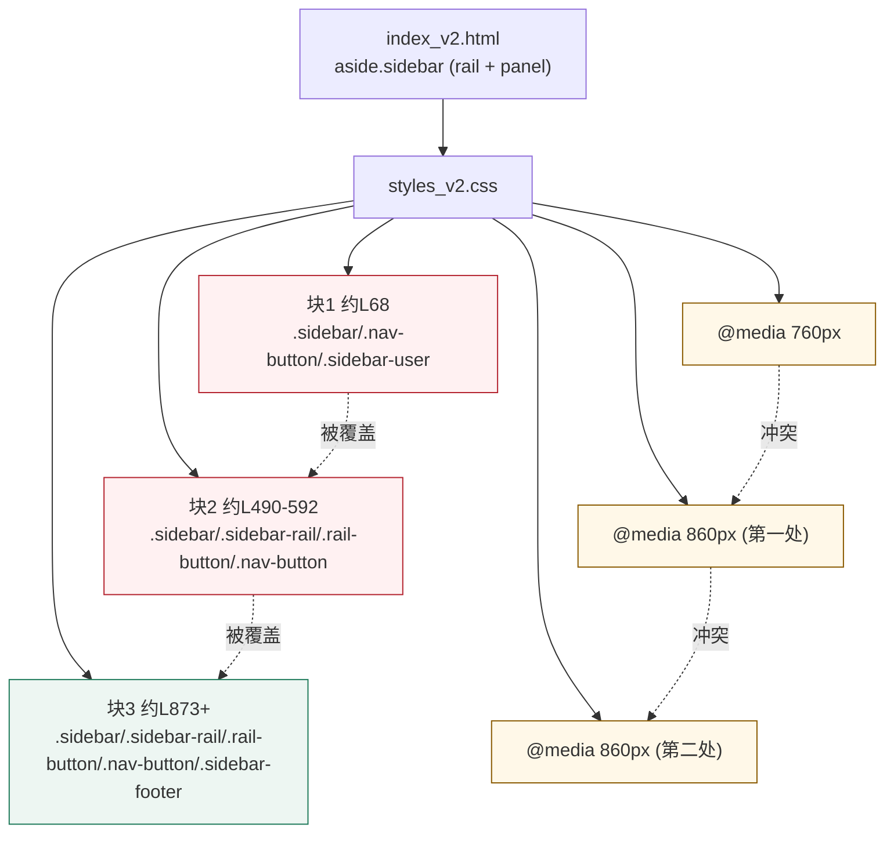
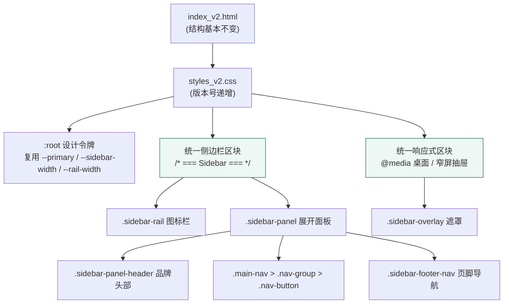
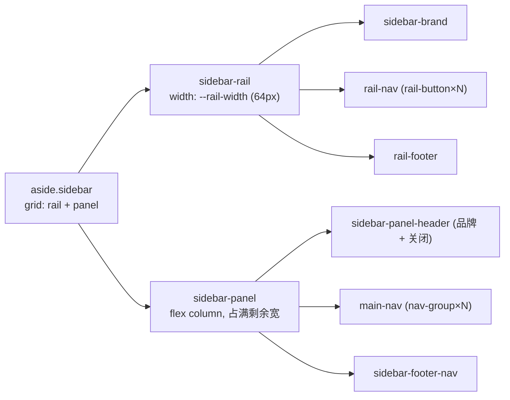

# 设计文档：左侧导航样式优化（sidebar-style-refresh）

## Overview

当前系统正式对外提供的前端页面为 `templates/index_v2.html`，样式来自 `static/styles_v2.css`（当前版本号 `?v=20260719.4`），脚本为 `static/app_v2.js`。侧边栏采用「窄图标栏（rail）+ 展开面板（panel）」的双区结构，并通过 `data-role="ADMIN"/"OPERATOR"` 做角色可见性控制。

侧边栏"样式乱"的根因是可维护性问题而非结构问题：`static/styles_v2.css` 中对同一批侧边栏选择器（`.sidebar`、`.sidebar-rail`、`.sidebar-brand`、`.rail-nav`、`.rail-button`、`.nav-button`、`.nav-group-label`、`.sidebar-panel`、`.sidebar-user` 等）存在**至少三处重复且相互冲突的定义**（约在第 68 行、第 490–592 行、第 873 行之后），并伴随多组重叠的响应式媒体查询（`@media (max-width: 760px)`、两处 `@media (max-width: 860px)`）以及重复的 `.sidebar-overlay { display: none }`。这些层叠规则依靠 CSS "后者覆盖前者"的机制勉强生效，导致间距、图标尺寸、激活态、品牌区高度等在不同规则块之间互相打架，呈现出杂乱、不一致的观感。

本设计的目标是：参考 fantastic-admin（https://fantastic-admin.hurui.me/）简洁清爽的后台导航观感，在**保留项目现有品牌绿色（`--primary`）色系**与既有 rail/panel 双区 DOM 结构的前提下，将侧边栏样式**合并为唯一一套权威规则**，统一品牌头部、分组标签、菜单项间距、悬停态与选中态，规范图标尺寸与对齐，并整理响应式（窄屏抽屉 + 遮罩）行为。范围限定在左侧导航区域及其响应式行为，不改动无关组件。

## Architecture

### 当前样式加载与冲突关系



### 目标样式结构（合并为单一权威区块）



### 桌面态侧边栏布局关系



## Components and Interfaces

本设计的"接口"是 HTML class 契约与其对应的样式行为约定。DOM 结构保持不变，样式必须与既有 class 名对齐。

### 组件 1：侧边栏容器 `.sidebar`

**Purpose**：作为固定定位的左侧导航容器，桌面态以栅格排布图标栏与展开面板。

**样式契约**：
```text
.sidebar
  - 唯一定义，固定定位于视口左侧，高度 100vh
  - 桌面态：display:grid，列为 [--rail-width] [1fr]，容纳 .sidebar-rail 与 .sidebar-panel
  - 背景 var(--surface)，右侧 1px var(--line) 分隔线
  - z-index 高于主内容，低于弹层
```

**Responsibilities**：
- 提供桌面/窄屏两种排布的根容器
- 承载窄屏抽屉展开/收起的状态类（如 `.sidebar.open` 或既有开关机制）

### 组件 2：图标栏 `.sidebar-rail`

**Purpose**：始终可见的窄图标导航列。

**样式契约**：
```text
.sidebar-rail
  - 宽度 var(--rail-width)，纵向 flex 布局，居中对齐
  - 顶部 .sidebar-brand，中部 .rail-nav，底部 .rail-footer(margin-top:auto)
.rail-button
  - 统一尺寸的方形按钮（如 46–48px），圆角 var(--radius)
  - 图标统一 20px，默认 opacity ~0.8
  - :hover 使用浅底 var(--primary-soft) 或中性浅灰
  - .active 使用 var(--primary) 文字/图标 + var(--primary-soft) 底色
```

### 组件 3：展开面板 `.sidebar-panel` 与主菜单 `.main-nav`

**Purpose**：显示分组标签与带文字的菜单项。

**样式契约**：
```text
.sidebar-panel-header
  - 高度 var(--header-height)，展示品牌名，与顶栏基线对齐
  - 含 .sidebar-close（窄屏可见，桌面隐藏）
.main-nav
  - 纵向排布 .nav-group，可滚动（overflow-y:auto）
.nav-group-label
  - 分组标签：小字号、次要色(var(--muted) 或近似)、字间距，作为分区提示
.nav-button
  - 统一高度（如 42–44px）、统一左右内边距、图标与文字间距一致
  - 默认中性文字色；:hover 浅底
  - .active：var(--primary) 文字 + var(--primary-soft) 底 + 左侧 3px 强调条(inset box-shadow)
.nav-button .nav-icon
  - 统一 icon 尺寸与对齐，active 态提高不透明度/着色
```

### 组件 4：页脚导航与用户区 `.sidebar-footer-nav` / `.sidebar-user`

**样式契约**：
```text
.sidebar-footer-nav
  - margin-top:auto 贴底，含"系统设置""帮助中心"
.sidebar-footer-button
  - 与 .nav-button 一致的高度、内边距、hover 表现
.sidebar-user
  - 保持既有可见性策略（当前带 .sr-only），不引入视觉回归
```

### 组件 5：遮罩 `.sidebar-overlay`

**样式契约**：
```text
.sidebar-overlay
  - 唯一定义（消除重复的 display:none）
  - 桌面态隐藏；窄屏抽屉展开时显示半透明遮罩，点击关闭
```

## Data Models

侧边栏样式依赖以下"状态类"与"设计令牌"，二者构成样式的数据模型。

### 状态类（由 app_v2.js 切换，样式据此呈现）

| 状态类 | 作用域 | 视觉表现 |
| --- | --- | --- |
| `.active` | `.rail-button` / `.nav-button` | 选中态：主色文字 + 浅主色底 + 左强调条 |
| `.open`（或既有开关类） | `.sidebar` | 窄屏抽屉展开 |
| `.hidden` | `.sidebar-overlay` | 遮罩显隐 |
| `[data-role]` | `.nav-group` / `button` | 角色可见性（由脚本控制，样式不重复实现） |

**约束**：本次仅调整样式呈现，不新增/重命名状态类；若必须新增，需在 tasks 中显式说明并同步 `app_v2.js`。

### 复用的设计令牌（:root，禁止硬编码替代）

| 令牌 | 值 | 用途 |
| --- | --- | --- |
| `--primary` | `#1f7a5a` | 选中态文字/图标/强调条 |
| `--primary-hover` | `#176347` | 主色悬停 |
| `--primary-soft` | `#edf6f2` | 选中/悬停底色 |
| `--surface` | `#ffffff` | 侧边栏背景 |
| `--text` / `--muted` | `#1f2933` / `#69766f` | 主/次文字色 |
| `--line` | `#e3e8e6` | 分隔线 |
| `--sidebar-width` | `270px` | 面板+栏总宽 |
| `--rail-width` | `64px` | 图标栏宽 |
| `--header-height` | `64px` | 头部/顶栏对齐基线 |
| `--radius` / `--radius-sm` | `8px` / `6px` | 按钮圆角 |

**Validation Rules（样式一致性规则）**：
- 同一选择器在非媒体查询作用域内只允许出现一次权威定义
- 所有颜色优先引用 `:root` 令牌，避免散落的十六进制硬编码
- 图标尺寸、按钮高度、内边距在 rail 与 panel 内各自保持一致

## Correctness Properties

> *属性是指在系统所有有效执行中都应成立的特征或行为。本特性为 CSS/样式重构，属于 UI 呈现范畴，依据 PBT 适用性指南，视觉/感知类验收标准不适合属性测试（不引入 PBT）。因此以下属性为可对 `static/styles_v2.css` / `templates/index_v2.html` 做**静态检查**的结构性不变式；带有视觉/感知性质的验收标准通过静态检查 + 人工评审共同验证，已在对应属性中标注。*

### Property 1: 顶层选择器唯一权威定义

对于每个侧边栏顶层选择器 `S ∈ {.sidebar、.sidebar-rail、.sidebar-brand、.rail-nav、.rail-button、.nav-button、.nav-group-label、.sidebar-panel、.sidebar-user、.sidebar-footer-nav}`，`S` 在非媒体查询作用域内作为独立规则选择器出现的次数恰好为 1。
- 验证方式：静态检查（统计选择器出现次数）
- **Validates: Requirements 1.1, 7.5, 9.1**

### Property 2: 遮罩 display:none 唯一

`.sidebar-overlay` 的 `display: none` 声明在整个样式表中出现的次数恰好为 1。
- 验证方式：静态检查
- **Validates: Requirements 1.2, 7.1**

### Property 3: 无重复等价媒体查询断点

`max-width: 760px` 与 `max-width: 860px` 各自在样式表中最多对应一个媒体查询规则块，不存在相同阈值的重复媒体查询。
- 验证方式：静态检查
- **Validates: Requirements 1.3**

### Property 4: 颜色取值均引用令牌

在侧边栏样式规则集合中出现的任意颜色取值都通过 `var(--...)` 引用 `:root` 设计令牌；除 `:root` 声明块外不出现十六进制颜色字面量（`#RGB` / `#RRGGBB`）。
- 验证方式：静态检查（扫描侧边栏规则内的 `#` 十六进制字面量）
- **Validates: Requirements 1.4, 8.3, 8.4, 8.1**

### Property 5: 品牌头部高度与关闭控件存在性

`.sidebar-panel-header` 使用 `--header-height` 令牌作为高度取值，且样式表内存在 `.sidebar-close` 的规则定义。
- 验证方式：静态检查（取值与选择器存在性）；基线对齐的视觉表现（Requirement 2.1 的 0px 偏移）另经人工评审
- **Validates: Requirements 2.1, 2.2, 2.3**

### Property 6: 关闭控件响应式显隐

存在使 `.sidebar-close` 在视口宽度 ≥ 860px 时隐藏（不可见且不占布局）、在 < 860px 时可见的响应式规则。
- 验证方式：静态检查（媒体查询与 display/visibility 声明存在）；实际显隐效果另经人工评审
- **Validates: Requirements 2.4, 2.5**

### Property 7: 分组标签取值一致且跨形态复用

所有 `.nav-group-label` 应用完全相同的字号（12px）、文字色（`--muted` 或等价次要文字色令牌）与上下外边距取值；展开面板与窄屏抽屉两种形态复用同一套取值，不因响应式区块产生差异。
- 验证方式：静态检查（逐项取值一致性 + 无响应式覆盖差异）
- **Validates: Requirements 3.1, 3.2, 3.3**

### Property 8: 菜单项与图标尺寸一致

所有 `.nav-button` 应用相同的固定高度 44px、相同左右内边距 12px、图标与文字间 12px 固定间距；所有 `.rail-button` 应用相同的 46px × 46px 尺寸与 `--radius`（8px）圆角；`.rail-button` 图标与 `.nav-button .nav-icon` 均为 20px × 20px。
- 验证方式：静态检查（逐项取值一致性）；`.nav-icon` 相对文字基线垂直居中的视觉表现另经人工评审
- **Validates: Requirements 4.1, 4.2, 4.3, 4.4, 10.1**

### Property 9: 长文案单行省略且高度不变

`.nav-button` 存在单行省略号截断相关声明（如 `white-space: nowrap`、`overflow: hidden`、`text-overflow: ellipsis`），使文字过长时按钮高度维持 44px、面板宽度不变。
- 验证方式：静态检查（省略号声明存在 + 固定高度）；实际截断表现另经人工评审
- **Validates: Requirements 4.5, 10.2**

### Property 10: 悬停态使用统一浅底令牌

未选中的 `.rail-button` 与 `.nav-button` 的 `:hover` 态引用相同的 `--primary-soft` 令牌作为悬停底色，且不使用非绿色系主色。
- 验证方式：静态检查（hover 规则引用同一令牌）
- **Validates: Requirements 5.1, 8.5**

### Property 11: 选中态主色令牌与强调条

`.rail-button.active` 与 `.nav-button.active` 使用 `--primary` 作为文字/图标颜色、`--primary-soft` 作为底色；`.nav-button.active` 通过 inset box-shadow 在左侧呈现 3px `--primary` 强调条，并将 `.nav-icon` 不透明度提高至 1。
- 验证方式：静态检查（active 规则的令牌引用与强调条声明存在）；对比度 ≥ 4.5:1 另经人工/工具评审
- **Validates: Requirements 5.2, 5.4, 5.5, 8.1, 10.4**

### Property 12: 选中态优先于悬停态

`.nav-button.active` 相关规则的特指性/层叠顺序使其在同时处于 `.active` 与 `:hover` 时优先于纯 `:hover` 规则呈现。
- 验证方式：静态检查（选择器特指性与源顺序）；叠加态视觉表现另经人工评审
- **Validates: Requirements 5.3**

### Property 13: 页脚导航贴底且与菜单项一致

`.sidebar-footer-nav` 通过 `margin-top: auto` 贴底；`.sidebar-footer-button` 的高度与内边距与 `.nav-button` 逐项相等（差异 0px），且悬停底色引用相同的 `--primary-soft` 令牌。
- 验证方式：静态检查（取值一致性 + 令牌引用）；不与最后一个 `.nav-group` 重叠的表现另经人工评审
- **Validates: Requirements 6.1, 6.2, 6.3**

### Property 14: 用户区可见性与无障碍行为不变

`.sidebar-user` 在桌面态与窄屏态的可见性、占位与尺寸相较重构前保持不变，并保留 `.sr-only` 行为（对辅助技术可读但不占可见布局空间）。
- 验证方式：静态检查（`.sr-only` 规则保留）；跨态可见性不变另经人工/回归评审
- **Validates: Requirements 6.4, 6.5**

### Property 15: 响应式抽屉与遮罩行为

视口 ≥ 860px 时 `.sidebar-overlay` 隐藏；< 860px 且 `.sidebar.open` 时 `.sidebar` 以固定定位覆盖式抽屉显示于主内容之上、`.sidebar-overlay` 以 0.3–0.6 不透明度显示并覆盖抽屉以外的整个视口，其显隐由 `.hidden` 状态类控制；桌面态与窄屏态复用同一套权威规则，仅由响应式区块调整布局。
- 验证方式：静态检查（媒体查询、定位、opacity 区间、`.hidden` 控制、规则复用）；抽屉/遮罩交互表现另经人工评审
- **Validates: Requirements 7.1, 7.2, 7.3, 7.4, 7.5**

### Property 16: 设计令牌取值复用

`--sidebar-width`（270px）、`--rail-width`（64px）、`--header-height`（64px）、`--radius`（8px）在对应用途处以令牌引用；主色/强调色均解析为品牌绿色令牌（`--primary`/`--primary-hover`/`--primary-soft`），无非绿色系主色；令牌未定义时回退至条款列明的具体取值。
- 验证方式：静态检查（令牌引用与回退值存在、无蓝色等非绿色主色字面量）
- **Validates: Requirements 8.2, 8.3, 8.4, 8.6, 8.1**

### Property 17: DOM 结构与状态类契约不变

样式表沿用既有 rail/panel 双区 DOM 结构与既有 class 集合，不新增/删除/重命名被 `app_v2.js` 引用的 class 或 DOM 元素；不含任何基于 `[data-role]` 的显隐/过滤规则；`app_v2.js` 内容相较重构前保持不变（除条款 9.2 记录的必要同步改动外）。
- 验证方式：静态检查（class 集合对齐、无 `[data-role]` 选择器、`app_v2.js` diff 为空）
- 映射：Requirement 9.1、9.2、9.3、9.4、9.5

### Property 18: 减少动效偏好

在 `prefers-reduced-motion: reduce` 下，侧边栏相关过渡时长不超过 0.01 秒且无可感知动画。
- 验证方式：静态检查（`@media (prefers-reduced-motion: reduce)` 规则存在且过渡时长 ≤ 0.01s）
- 映射：Requirement 10.3

### Property 19: 缓存刷新版本号递增且一致

当 `static/styles_v2.css` 的侧边栏样式被重构更新时，`templates/index_v2.html` 中引用样式表的 `?v=` 版本号更新为严格大于旧值的新值（按既有 `20260719.4` 格式递增）；若存在多处引用则全部采用同一新版本号，不混用新旧值；文件名与路径保持不变。
- 验证方式：静态检查（版本号比较、全部引用一致、路径不变）
- 映射：Requirement 11.1、11.2、11.3

## Error Handling

### 场景 1：窄屏下抽屉与主内容重叠
- **Condition**：视口宽度小于断点时抽屉展开
- **Response**：`.sidebar` 覆盖式定位并显示 `.sidebar-overlay` 半透明遮罩
- **Recovery**：点击遮罩或关闭按钮收起抽屉，焦点返回触发按钮

### 场景 2：图标资源缺失
- **Condition**：`/static/icons/*.svg` 未加载
- **Response**：`img.nav-icon` 的 `alt=""` 使其静默降级，按钮文字与可点击区域保持可用
- **Recovery**：不阻断导航；布局不因图标缺失而错位（按钮尺寸由容器约束）

### 场景 3：长文案/多语言导致换行
- **Condition**：菜单文字过长
- **Response**：文字单行省略或受控换行，按钮高度稳定，不撑破面板
- **Recovery**：`--sidebar-width` 提供足够宽度；必要时省略号处理

### 场景 4：偏好减少动效
- **Condition**：用户系统开启 `prefers-reduced-motion`
- **Response**：保留既有 `@media (prefers-reduced-motion: reduce)` 规则，过渡时长趋近于 0

## Testing Strategy

### Unit / 静态检查
- 校验 `styles_v2.css` 中每个侧边栏顶层选择器（非媒体查询作用域）仅有一处定义（可用脚本统计出现次数）
- 校验不存在重复的 `.sidebar-overlay { display: none }` 与重叠等价的媒体查询断点
- 校验关键选择器（`.sidebar`、`.rail-button`、`.nav-button`、`.nav-button.active`、`.nav-group-label`、`.sidebar-overlay`）存在且激活态引用了 `--primary` / `--primary-soft`

### Property-Based Testing（属性测试适用性评估）
本特性为 CSS/样式重构，属于 UI 呈现范畴。依据 PBT 适用性指南，UI 渲染与样式**不适合**属性测试。因此**不引入属性测试**，改用上述静态检查与快照/人工评审。

### 视觉与交互回归（人工 + 快照）
- 桌面态：品牌头部、分组标签、菜单项间距、hover、active、页脚一致
- 窄屏态：抽屉展开/收起、遮罩点击关闭、焦点管理
- 角色态：以 ADMIN 与 OPERATOR 两种角色分别核对可见菜单分组
- 保留既有 `aria-*`、`title`、`sr-only` 无障碍属性，选中态对比度充足

## Performance Considerations
- 纯 CSS 合并，删除冗余规则可减小样式表体积、降低层叠计算复杂度
- 更新样式表版本号（`?v=`）以突破浏览器缓存

## Security Considerations
- 不涉及权限逻辑变更；角色可见性仍由脚本控制，样式不得成为唯一的权限隐藏手段（`[data-role]` 的实际过滤仍在 `app_v2.js`）

## Dependencies
- 受影响文件：`static/styles_v2.css`（主要）、`templates/index_v2.html`（仅在必要时做最小结构/版本号调整）
- 图标资源：`static/icons/*.svg`（沿用，不新增）
- 脚本：`static/app_v2.js`（状态类切换逻辑，原则上不改动）
- 无新增第三方库或 CSS 框架

## 范围约束（Scope Constraints）
- 本次以 `static/styles_v2.css` 侧边栏样式重构为主，`templates/index_v2.html` 仅在必要时做最小调整
- 不重写无关组件；不修改 legacy 的 `styles.css` / `app.js` / `index.html`
- 保留项目品牌绿色系，不照搬 fantastic-admin 的默认蓝色
